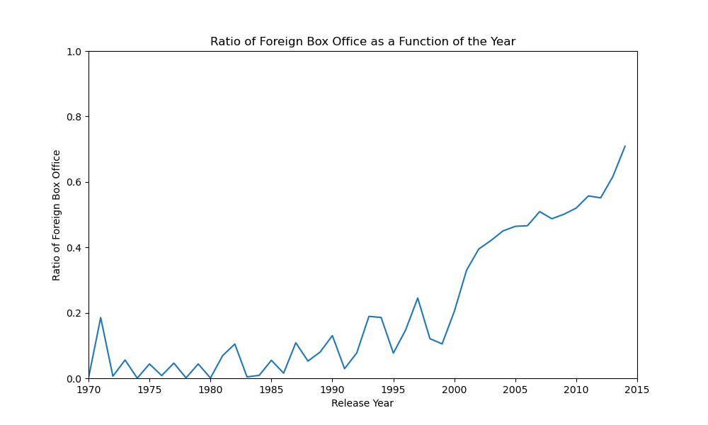
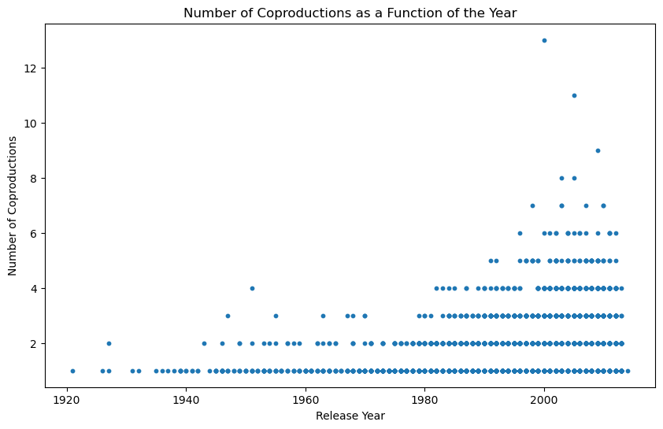
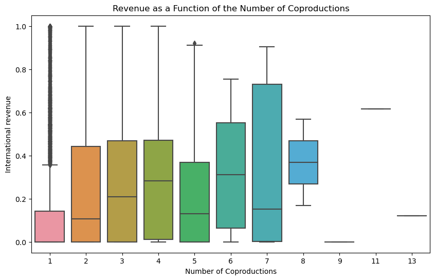

<meta http-equiv='cache-control' content='no-cache'> 
<meta http-equiv='expires' content='0'> 
<meta http-equiv='pragma' content='no-cache'>

# Welcome to Our Analysis of the CMU Movie Dataset

In this ADA project, we studied which factors may influence the international success of a movie, measureed by the proportion of it's box office done outside of its production countries.

## Table of Contents
- [Introduction](#introduction)
- [Evolution Across Time](#evolution-across-time)
- [Influence of the genre](#influence-of-the-genre)
- [Influence of the production countries](#influence-of-the-production-countries)
- [Conclusion](#conclusion)

## Introduction

Welcome to our detailed exploration of the fascinating world of movies. In this project, we dive deep into the CMU Movie Dataset, combined with IMdBs box office data ([**BoxOfficeMojo.com**](https://www.boxofficemojo.com/)) unraveling the intricate factors that contribute to the international success of films. Our journey through this dataset is not just about numbers and charts; it's a story about how movies transcend borders and cultural barriers to captivate audiences worldwide.

We examine various elements such as genre preferences, box office trends, and the impact of production countries on a movie's global appeal. By combining statistical analysis with insightful visualizations, we aim to provide a comprehensive understanding of what makes a movie resonate internationally.

Join us as we uncover the hidden narratives behind the data and reveal the evolving landscape of the film industry in an increasingly interconnected world.

## Evolution Across Time

 We observed a nuanced shift in the patterns of international success of movies over the years. By integrating box office data with release dates, we could effectively trace the trajectory of international appeal. Our analysis revealed a gradual increase in the international market share of movies, especially in the latter half of the 20th century and early 21st century. 

We can clearly observe a trend since the the start of the 21st century of the ratio of the box office done internationally. Multiple factors could explain this observation : 
- Due to gloablisation, over the past few decades the investments in publicity abroad has drastically increased, and due to new technologies it is much easier to reach a wider audience
- Thanks to internet, it is much easier to gather data on international box office now than before, so we might have more accurate distribution of the box office per country

## Influence of the genre

## Influence of the Production Countries

In our dataset, we have access to the countries of production of the movies. We were interested in the evolution of co-productions across time, and whether co-productions betweeen countries affects its exports. Also which countries export most ?

As we see, as time advances, movies production companies from different countries seem to work more and more together. Now let us see the impact of co-producing on the total revenue of the movies as well as the share done outside their borders :

## Conclusion
Content for the conclusion..

- [Analysis Part 1](network_region.md)
- [Analysis Part 2](notebook.md)

Explore our findings and discover interesting trends and patterns in movie data!
