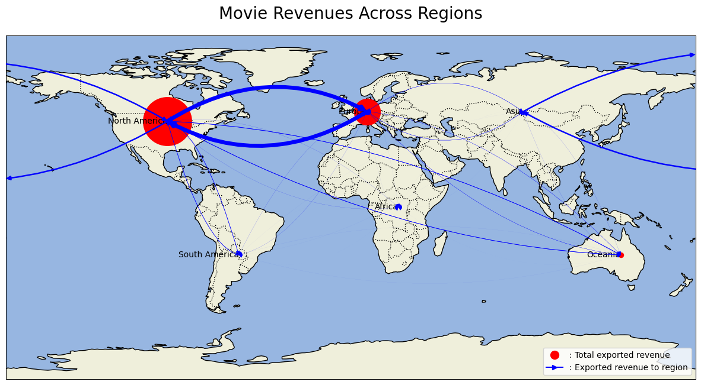

<meta http-equiv='cache-control' content='no-cache'> 
<meta http-equiv='expires' content='0'> 
<meta http-equiv='pragma' content='no-cache'>

# Welcome to Our Analysis of the CMU Movie Dataset

Over half of the global film revenues are realized internationally, beyond the confines of the movies originating nations. In a world where movies not only entertain but also influence and connect cultures, understanding the factors that drive international success is more crucial than ever. What makes a movie resonate beyond its home turf? Let's explore.

## Table of Contents
- [Introduction](#introduction)
- [Evolution Across Time](#evolution-across-time)
- [Influence of the genre](#influence-of-the-genre)
- [Influence of Co-Productions](#influence-of-the-production-countries)
- [Influence of diversity](#influence-of-diversity)
- [Conclusion](#conclusion)

## Introduction

Welcome to our detailed exploration of the fascinating world of movies. In this project, we dive deep into the CMU Movie Dataset, combined with IMdB's box office data ([**BoxOfficeMojo.com**](https://www.boxofficemojo.com/)) unraveling the intricate factors that contribute to the international success of films. Our journey through this dataset is not just about numbers and charts; it's a story about how movies transcend borders and cultural barriers to captivate audiences worldwide.

We examine various elements such as genre preferences, box office trends, and the impact of production countries on a movie's global appeal. By combining statistical analysis with insightful visualizations, we aim to provide a comprehensive understanding of what makes a movie resonate internationally.

Join us as we uncover the hidden narratives behind the data and reveal the evolving landscape of the film industry in an increasingly interconnected world.

## Evolution Across Time

 We observed a nuanced shift in the patterns of international success of movies over the years. By integrating box office data with release dates, we could effectively trace the trajectory of international appeal. Our analysis revealed a gradual increase in the international market share of movies, especially in the latter half of the 20th century and early 21st century. 
 

    <iframe src="plots/foreign_evolution.html"></iframe>

We can clearly observe a trend since the start of the 21st century of the ratio of the box office done internationally. Multiple factors could explain this observation : 
- Due to gloablisation, over the past few decades the investments in publicity abroad has drastically increased, and due to new technologies it is much easier to reach a wider audience
- Thanks to internet, it is much easier to gather data on international box office now than before, so we might have more accurate distribution of the box office per country

Our following network graph illuminates the flow of movie exports across continents, with a spotlight on the USA and Europe as key players. These regions dominate both in producing and exporting films, particularly to each other, underscoring their significant roles in the global film industry. This visualization captures the essence of their cinematic exchange and the wider reach of their movies worldwide, reflecting the universal appeal and cross-cultural impact of cinema.

## Influence of the genre

 The first factor we studied was the influence of the genre on the international success of movies. We looked at the proportion of the box office done outside of the production countries, and the total box office, for each genre. We also looked at the evolution of the proportion of the box office done outside of the production countries for each genre across time.
 
First, in order to get an idea of how many genres there are per movie, here is a histogram representing the distribution of the number of genres across movies:

 

 

    <iframe src="plots/nb_genres.html"></iframe>

Most movies have multiple genres, and the most common number of genres is 3. We can also see that there are a lot of movies with only one genre, and a few movies with 7 or more genres.

Now let us look at which genres export the most, as well as the recent evolution of the most exported genres :

    <iframe src="plots/most_international_genres.html"></iframe>

    <iframe src="plots/genre_evolution.html"></iframe>

As we see from above, science-fiction and thriller genres emerge as the most exported movie categories. This popularity can be attributed to their wide appeal, cutting-edge special effects, and often universal themes that resonate across different cultures. On the other hand, the World cinema and Documentary genres appear to be the least exported. This could be due to their niche appeal and the fact that documentaries and World cinema movies often delve into culturally specific subjects, which might not translate as effectively to international audiences. 

Now, let's explore the genres that dominate exports from each continent and identify which genres are most popular among viewers in these regions.

    <iframe src="plots/pie_chart_exported.html"></iframe>

    <iframe src="plots/pie_chart_watched.html"></iframe>

As we delve into these charts, we can see some interesting patterns emerge. For instance, Asia stands out with its exceptionally diverse genre distribution in movie exports. This variety likely arises from the region's wide range of film styles, including the vivid storytelling of Bollywood, the creative flair of Japanese anime, and the engaging narratives of Chinese cinema, all contributing to Asia's unique presence in the international film market.

## Influence of Co-Productions

In this part we will analyse how the co-production of a movie across different countries influences it's success. First, let's take a look at all coproductions world-wide. 

    <iframe src="plots/country_co-productions.html"></iframe>

This interactive map shows us that alot of countries are involved in coproductions. We clearly see that the USA, the UK, France and Germany are involved in most of them. By zooming in we can also see how european countries are involved in alot of coproductions. 

Let's now take a look at the evolution of the proportion of coproduced films across time. 

    <iframe src="plots/movies_coprod_ratio.html"></iframe>

The prevalence of co-produced movies is rising, yet compared to the overall surge in film production, their proportion remains consistent. Analysis of recent trends reveals a marginal uptick in multi-country collaborations over the past two decades, hinting that co-productions may modestly enhance a movie's revenue. This raises key questions: What is the optimal number of countries for maximizing revenue, and how many should collaborate to maximize revenue generated outside the production countries?

    <iframe src="plots/mean_revenue_coprod_number.html"></iframe>

So on average movies made in two countries are the ones yielding the most revenues. The use of T-test allowed us to see that the difference in mean was statistically significant, which allows us to conclude that the collaboration of two countries should lead on average to a higher grossing film than any other number of co-production coutries. Even if the test allows us to say that the difference is statistically different the T-statistic is rather small (~2), this tells us that although a difference exists it has a moderated impact.

### Coproduction countries vs. ratio of international revenue

We now know that the best number of countries for total gross is usually 2, 

is this the same if we look at the ratio of the revenue made outside of the production countries? I'll let you pause for a minute and think about how increasing the number of co-production countries might affect the international ratio.

The following graphs are two representation of the same idea. The first one represents the proportion of revenue that was made internationally as a function of the number of production countries. The second one gives us a more accurate idea about the distribution of the values. 

    <iframe src="plots/mean_ratio_coprod.html"></iframe>

    <iframe src="plots/ratio_int_box_coprod.html"></iframe>

The data reveals that films with more co-production countries tend to earn a higher ratio of their revenue in foreign markets. This trend is counterintuitive, as one would expect fewer foreign countries to target for revenue as the number of production countries increases. Yet, surprisingly, our analysis shows a positive correlation between more co-producing countries and higherf foreign market revenue.

Statistical validation through T-tests confirms this relationship, with a notable T-statistic of -19 for films with one vs. multiple production countries. 

Further T-test analyses on different countries indicate that the USA benefits most from co-productions, showing a significant T-statistic of -13. France and India also see benefits, albeit to a lesser extent, with T-statistics around -3.

### Influence of the number of regions 

We made a small analysis about the number of region that produced a movie and its relation to the ratio of international revenue. We found very similar results as for the number of co-production countries. We can explain that by the fact that 75% of the co-produced movies have countries from multiple regions. We can make the simplified hypothesis that adding a country is like adding a region so we won't repeat ourselves.    

## Influence of the number of languages

We will now analyse how the number of languages in a movie influence it's performance internationally. Let's start by looking at the proportion of films with more than one language across time.

    <iframe src="plots/movies_lang_ratio.html"></iframe>

This graph is really similar to the one about the ratio of movies made by more than one country. Our anaylsis stays the same if we see an augmentation it is probably due to multiple factors, one of them being that it should help boost the revenue of the movies. As before we ask ourself how many language should a movie have to have the best expected revenue? And is this the same number if we want our movie to export as much as possible?

    <iframe src="plots/gross_languages.html"></iframe>

In the graph above we only kept movies that have up to five languages because our dataset doesn't contain enough movies with more infomation to be relevant in our study. This visualisation shows us that the more languages, or at least up to five languages, you have, the more on average your movie is suppose to make. Since we don't have enough information about movies with more languages we cannot say what the perfect number of languages would be, but we can say that the more the better although you probably don't want to overdo it. The T-test here is much clearer with a T-statistic of ~ -8, as usual the p/value is reallz small and allows us to say that the difference is statistically relevent. 

### Number of languages vs. ratio of international revenue

We saw that films with more languages have higher revenues on average. What about international revenue?

Do you think movies with more spoken languages have a higher proportion of international revenue ? 

We used the same representation as before. Two graphes showing the average export ratio of the movies gross revenues one as a line plot one as a box plot. 

    <iframe src="plots/mean_ratio_lang.html"></iframe>

    <iframe src="plots/ratio_int_box_lang.html"></iframe>

Films with multiple languages show a higher ratio of international revenue. T-tests confirm this is statistically significant (T-stat ~ -14 for films with one vs. multiple languages). Among languages analyzed, English benefits most from mixing with others (T-stat ~ -13). French and Japanese also show gains, albeit smaller (T-stat ~ -3 each). For Spanish and Hindi, however, the difference isn't statistically significant.

## Influence of Diversity

When investigating if diversity impacted the performance in a movie, we looked at 3 different factors : 
- The gender ratio and representation of the actors
- The ethnicity of the actors
- The number of languages spoken in the movies

### Gender Representation

We analysed the proportion and number of both male and female actors, as well as cast sizes, and looked for links with the performance, internationally and globally:

    <iframe src="plots/gross_per_female_ratio.html"></iframe>

    <iframe src="plots/ratio_export_per_female.html"></iframe>

We observe that although there is a negative correlation between the ratio of female actors to the total number of actors and the revenue (spearman correlation of -0.14, P Value extremely close to 0), the international share of the gross does not seem significantly impacted (spearman correlation of -0.04, P Value extremely close to 0 once again). 

### Ethnic Diversity

Another factor taken into account is whether the number of represented ethnicities in a movie would have an impact. After retrieving the ethnicities of the actors we had access to in the CMU Dataset, we came up with a diversity score metric which we call ethnicicty entropy. 

We calculate this metric by calculating for each ethnicity in a film cast, the proportion p of actors in the cast having that ethnicity, we then sum up the values p*log(1/p) for each ethnicity in the cast, this gives us the entropy of the ethnicities in the cast.

For a given number of represented ethnies, the entropy is maximal when each ethnies appear with equal proportion, also the entropy is higher if there are more ethnicities. Therefore this metrics takes into account the number of ethnicities as well as the equality of distribution of these ethnicities amongst the cast.

We then looked at the correlation between this entropy and the international share of the gross.

    <iframe src="plots/ethnic_entropy"></iframe>

As we can see the entropy of the ethnies is positively correlated with the international share of the gross, meaning that the more diverse the cast is, the more likely the movie is to be successful internationally.

## Conclusion

In conclusion, the film industry's success on the international stage is influenced by a complex interplay of factors. Co-productions, language diversity, genre appeal, and casting diversity all play crucial roles. As globalization continues to shape viewer preferences and distribution channels, understanding these dynamics becomes crucial for filmmakers aiming to captivate audiences worldwide. Our analysis offers a roadmap for navigating these trends, helping filmmakers and studios make informed decisions that resonate across borders.

- [Analysis Part 1](network_region.md)
- [Analysis Part 2](notebook.md)

Explore our findings and discover interesting trends and patterns in movie data!
