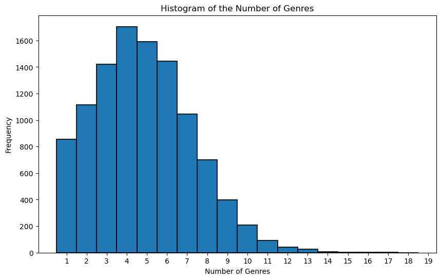
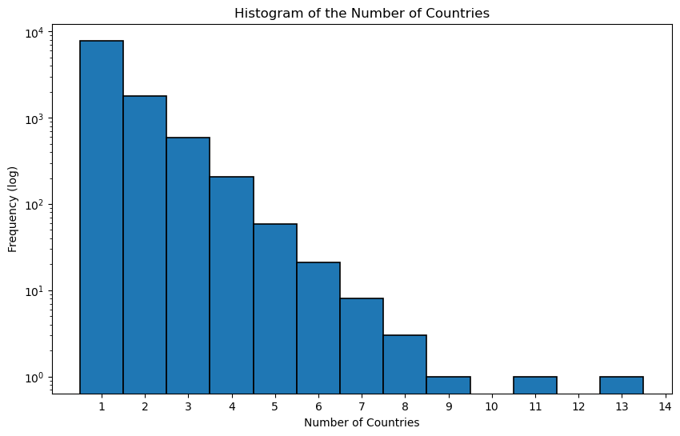
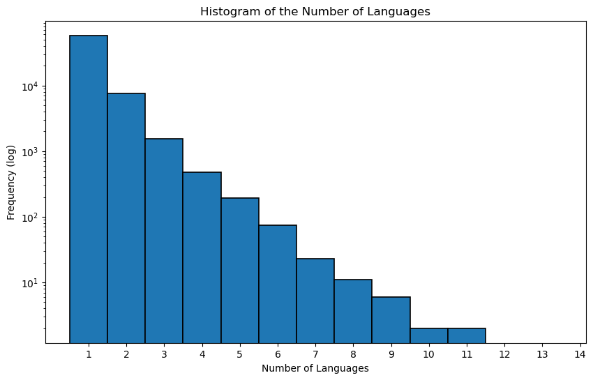
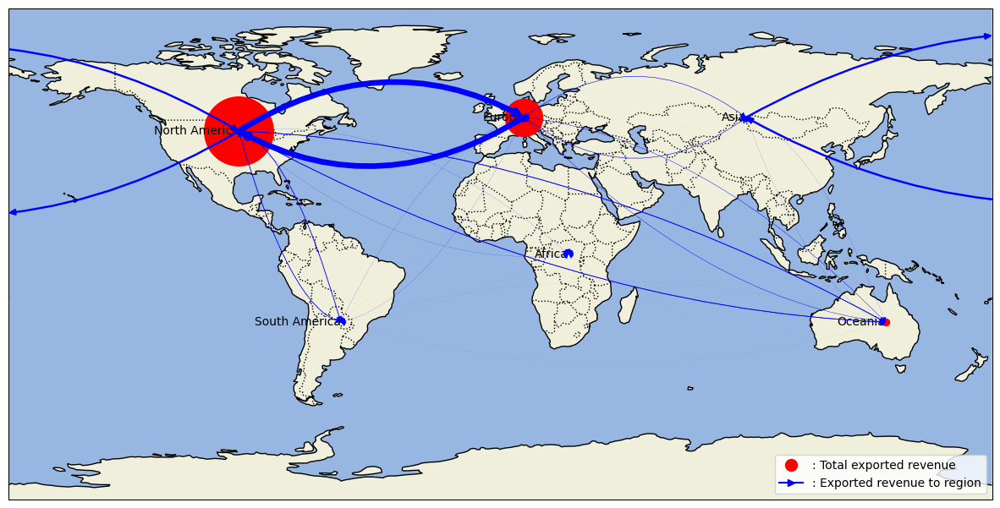

<meta http-equiv='cache-control' content='no-cache'> 
<meta http-equiv='expires' content='0'> 
<meta http-equiv='pragma' content='no-cache'>

test

```python
import pandas as pd
import numpy as np
import matplotlib.pyplot as plt
import seaborn as sns
import ast
```


```python
## read the tsv files in MovieSummaries
load_movies = pd.read_csv('../MovieSummaries/movie.metadata.tsv', sep = '\t', header = None)
load_character = pd.read_csv('../MovieSummaries/character.metadata.tsv', sep = '\t', header = None)

```


```python
movies = load_movies.copy()
character = load_character.copy()

```


```python
# Make the name of the colum of movie: wikip_ID, freebase_ID, name, release date, box office, runtime, languages, countries, genres	
movies.columns = ['Wiki_ID', 'Freebase_ID', 'name', 'release_date', 'box_office', 'runtime', 'languages', 'countries', 'genres']
# Make the name of the columns of character wiki_ID, freebase_ID, character_name, actor_DOB, actor_gender, actor_height, actor_ethnicity, actor_name, actor_age, freebase_character_map
character.columns = ['Wiki_ID', 'Freebase_ID','release_date', 'character_name', 'actor_DOB', 'actor_gender', 'actor_height', 'actor_ethnicity', 'actor_name', 'actor_age', '10', '11', '12']
character = character.drop(['10', '11', '12'], axis = 1)
```


```python
## read grossed merged clean csv
gross = pd.read_csv('../gross_merged_clean.csv')
gross
```


<div>
<style scoped>
    .dataframe tbody tr th:only-of-type {
        vertical-align: middle;
    }

    .dataframe tbody tr th {
        vertical-align: top;
    }

    .dataframe thead th {
        text-align: right;
    }
</style>
<table border="1" class="dataframe">
  <thead>
    <tr style="text-align: right;">
      <th></th>
      <th>tconst</th>
      <th>Wiki_ID</th>
      <th>Freebase_ID</th>
      <th>country</th>
      <th>movie</th>
      <th>gross</th>
    </tr>
  </thead>
  <tbody>
    <tr>
      <th>0</th>
      <td>tt0228333</td>
      <td>975900</td>
      <td>/m/03vyhn</td>
      <td>Domestic</td>
      <td>ghosts of mars</td>
      <td>8709640.0</td>
    </tr>
    <tr>
      <th>1</th>
      <td>tt0228333</td>
      <td>975900</td>
      <td>/m/03vyhn</td>
      <td>France</td>
      <td>ghosts of mars</td>
      <td>1937390.0</td>
    </tr>
    <tr>
      <th>2</th>
      <td>tt0228333</td>
      <td>975900</td>
      <td>/m/03vyhn</td>
      <td>Spain</td>
      <td>ghosts of mars</td>
      <td>509536.0</td>
    </tr>
    <tr>
      <th>3</th>
      <td>tt0228333</td>
      <td>975900</td>
      <td>/m/03vyhn</td>
      <td>Germany</td>
      <td>ghosts of mars</td>
      <td>496679.0</td>
    </tr>
    <tr>
      <th>4</th>
      <td>tt0228333</td>
      <td>975900</td>
      <td>/m/03vyhn</td>
      <td>United Kingdom</td>
      <td>ghosts of mars</td>
      <td>148898.0</td>
    </tr>
    <tr>
      <th>...</th>
      <td>...</td>
      <td>...</td>
      <td>...</td>
      <td>...</td>
      <td>...</td>
      <td>...</td>
    </tr>
    <tr>
      <th>90661</th>
      <td>tt0120202</td>
      <td>1918494</td>
      <td>/m/0660qx</td>
      <td>Denmark</td>
      <td>state and main</td>
      <td>13732.0</td>
    </tr>
    <tr>
      <th>90662</th>
      <td>tt0120202</td>
      <td>1918494</td>
      <td>/m/0660qx</td>
      <td>Australia</td>
      <td>state and main</td>
      <td>385631.0</td>
    </tr>
    <tr>
      <th>90663</th>
      <td>tt0107057</td>
      <td>664006</td>
      <td>/m/030xw6</td>
      <td>Domestic</td>
      <td>guilty as sin</td>
      <td>22866222.0</td>
    </tr>
    <tr>
      <th>90664</th>
      <td>tt1606259</td>
      <td>34980460</td>
      <td>/m/0g4pl34</td>
      <td>Domestic</td>
      <td>knuckle</td>
      <td>2647.0</td>
    </tr>
    <tr>
      <th>90665</th>
      <td>tt1606259</td>
      <td>34980460</td>
      <td>/m/0g4pl34</td>
      <td>United Kingdom</td>
      <td>knuckle</td>
      <td>22008.0</td>
    </tr>
  </tbody>
</table>
<p>90666 rows × 6 columns</p>
</div>


## Question 1

For The first question we will need the gross of the movies in the different region of the world, as well as their release year and their genre.


```python
movies_clean_gross = movies.copy()
gross_clean = gross.copy()

# Sum up the gross for each movie in the `gross` dataframe
gross_sum = gross_clean.groupby('Wiki_ID')['gross'].sum().reset_index()

# Merge this sum with the `movies` dataframe
movies_with_gross = movies_clean_gross.merge(gross_sum, on='Wiki_ID', how='left')

# Filter out rows where 'box_office' is not missing
non_missing_box_office = movies_with_gross.dropna(subset=['box_office'])


missing_percentage_before = movies_with_gross['box_office'].isna().sum() / len(movies_with_gross) * 100
print(f"Percentage of missing 'box_office' values before imputation: {missing_percentage_before:.2f}%")

# Check coherence for non-missing 'box_office' values
coherence_check = ((non_missing_box_office['box_office'] - non_missing_box_office['gross']).abs() / non_missing_box_office['box_office']).mean()
print(f"Average coherence deviation: {coherence_check:.2f}")

```

    Percentage of missing 'box_office' values before imputation: 89.72%
    Average coherence deviation: 0.34


There are a lot of box_office missing values, and for the ones we have, the summed gross differ from it by 34%, so replacing the Nans by the summed gross will not be accurate.

Instead, we should use the summed gross as the global box office for all the movies, and we can drop the box_office feature.


```python
movies_with_gross = movies_with_gross.drop(columns=['box_office'])
```


```python
# The release date of the movie is in the format of YYYY-MM-DD, we only need the year 
# so we split the date and only keep the year
movies_clean_release = movies_with_gross.copy()
movies_clean_release['release_date'] = movies_clean_release['release_date'].str[:4]
movies_clean_release['release_date'] = pd.to_numeric(movies_clean_release['release_date'], errors='coerce')
# Here the errors ignore is to keep the nan in the release date column
movies_clean_release['release_date'] = movies_clean_release['release_date'].astype(np.int64, errors='ignore')
```


```python
movies_clean_genre = movies_clean_release.copy()
movies_clean_genre['genres'] = movies_clean_genre['genres'].apply(lambda x: list(ast.literal_eval(x).values()))
# This line is to make the empty list to be nan so the nan are uniform
movies_clean_genre['genres'] = movies_clean_genre['genres'].apply(lambda x: x if len(x) != 0 else np.nan)

```


```python
gross_genre_release = gross_clean.copy()
#merge gross and movies_clean_genre on wiki_ID
gross_genre_release = gross_genre_release.merge(movies_clean_genre[['Wiki_ID', 'release_date', 'genres']], on = 'Wiki_ID', how = 'left')

```


```python
# count the numers of nan in genre
missing_genre_value = gross_genre_release.drop_duplicates(subset='Wiki_ID')['genres'].isna().sum()/gross_genre_release.drop_duplicates(subset='Wiki_ID')['genres'].shape[0]*100
print('The percentage of missing values in the genre column is {:.2f}%'.format(missing_genre_value))
```

    The percentage of missing values in the genre column is 0.14%


```python
number_of_genres = gross_genre_release.drop_duplicates(subset='Wiki_ID')['genres'].dropna().apply(lambda x: len(x))
# histogram of the number of genres
plt.figure(figsize=(10, 6))
plt.hist(number_of_genres,bins = np.arange(1, 20, 1)-0.5, edgecolor = 'black', linewidth = 1.2)
plt.xlabel('Number of Genres')
plt.xticks(np.arange(1, 20, 1))
plt.ylabel('Frequency')
plt.title('Histogram of the Number of Genres')
plt.show()
```


    

    


We have a very low percentage of genre missing we can therefore have a good analysis about this metric. We don't have any missing values for the release date because it was used as a key when merging the IMdB dataset with the CMU datset

## Question 3 


```python
movies_clean_country = movies_clean_genre.copy()
movies_clean_country['countries'] = movies_clean_country['countries'].apply(lambda x: list(ast.literal_eval(x).values()))
# This line is to make the empty list to be nan so the nan are uniform
movies_clean_country['countries'] = movies_clean_country['countries'].apply(lambda x: x if len(x) != 0 else np.nan)
```


```python
gross_country = gross_genre_release.copy()
#merge gross and movies_clean_genre on wiki_ID
gross_country = gross_country.merge(movies_clean_country[['Wiki_ID', 'countries']], on = 'Wiki_ID', how = 'left')
```


```python
# count the numers of nan in countries
missing_country_value = gross_country.drop_duplicates(subset='Wiki_ID')['countries'].isna().sum()/gross_country.drop_duplicates(subset='Wiki_ID')['countries'].shape[0]*100
print('The percentage of missing values in the countries column is {:.2f}%'.format(missing_country_value))
```

    The percentage of missing values in the countries column is 1.70%


```python
coprood_count = gross_country.dropna(subset='countries')
coprood_count = coprood_count.drop_duplicates(subset='Wiki_ID')[coprood_count['countries'].apply(lambda x: len(x)) > 1].shape[0]/gross_country.drop_duplicates(subset='Wiki_ID')['countries'].shape[0]*100

print('The number of movies that are co-produced by more than one country is {:.2f}%'.format(coprood_count))
```

    The number of movies that are co-produced by more than one country is 24.98%


    /tmp/ipykernel_25303/30425266.py:2: UserWarning: Boolean Series key will be reindexed to match DataFrame index.
      coprood_count = coprood_count.drop_duplicates(subset='Wiki_ID')[coprood_count['countries'].apply(lambda x: len(x)) > 1].shape[0]/gross_country.drop_duplicates(subset='Wiki_ID')['countries'].shape[0]*100


```python
number_of_countries = gross_country.drop_duplicates(subset='Wiki_ID')['countries'].dropna().apply(lambda x: len(x))
# histogram of the number of production countries
plt.figure(figsize=(10, 6))
plt.hist(number_of_countries,bins = np.arange(1, 15, 1)-0.5, edgecolor = 'black', linewidth = 1.2)
plt.xlabel('Number of Countries')
plt.xticks(np.arange(1, 15, 1))
plt.yscale('log')
plt.ylabel('Frequency (log)')
plt.title('Histogram of the Number of Countries')
plt.show()
```


    

    


We have a very low percentage of countries missing we can therefore have a good analysis about this metric. And the level of co-production is relatively high so it will still make sense to do our analysis.

## Question 4

For the gender representation in the movie. We decided to only use the values that were given for each of the movies, making the assumption that if the gender of an actor is not given the character was probably a small part. 


```python
# go in the character dataset and find the percentage of gender F in each movie
character_gender = character.copy()

#count the number of "F" for each wiki_ID in character_gender
# groupby wiki_ID and count the number of "F" in each group
character_groupby = character_gender.groupby('Wiki_ID')
character_groupby_tot = character_groupby["actor_gender"].count()
character_groupby_F = character_groupby.apply(lambda x: (x['actor_gender'] == 'F').sum())
ratio_female_to_total = character_groupby_F / character_groupby_tot


```


```python
data = {
    'Wiki_ID': ratio_female_to_total.index,
    'Ratio_Female_to_Total': ratio_female_to_total.values
}

# Create DataFrame
df_ratio = pd.DataFrame(data)

# Reset the index to make it 1-dimensional
df_ratio.reset_index(drop=True, inplace=True)
```


```python
movies_clean_gender = movies_clean_country.copy()
movies_clean_gender = movies_clean_gender.merge(df_ratio, on = 'Wiki_ID', how = 'left')
movies_clean_gender.head()
```


<div>
<style scoped>
    .dataframe tbody tr th:only-of-type {
        vertical-align: middle;
    }

    .dataframe tbody tr th {
        vertical-align: top;
    }

    .dataframe thead th {
        text-align: right;
    }
</style>
<table border="1" class="dataframe">
  <thead>
    <tr style="text-align: right;">
      <th></th>
      <th>Wiki_ID</th>
      <th>Freebase_ID</th>
      <th>name</th>
      <th>release_date</th>
      <th>runtime</th>
      <th>languages</th>
      <th>countries</th>
      <th>genres</th>
      <th>gross</th>
      <th>Ratio_Female_to_Total</th>
    </tr>
  </thead>
  <tbody>
    <tr>
      <th>0</th>
      <td>975900</td>
      <td>/m/03vyhn</td>
      <td>Ghosts of Mars</td>
      <td>2001.0</td>
      <td>98.0</td>
      <td>{"/m/02h40lc": "English Language"}</td>
      <td>[United States of America]</td>
      <td>[Thriller, Science Fiction, Horror, Adventure,...</td>
      <td>11996794.0</td>
      <td>0.352941</td>
    </tr>
    <tr>
      <th>1</th>
      <td>3196793</td>
      <td>/m/08yl5d</td>
      <td>Getting Away with Murder: The JonBenét Ramsey ...</td>
      <td>2000.0</td>
      <td>95.0</td>
      <td>{"/m/02h40lc": "English Language"}</td>
      <td>[United States of America]</td>
      <td>[Mystery, Biographical film, Drama, Crime Drama]</td>
      <td>NaN</td>
      <td>0.266667</td>
    </tr>
    <tr>
      <th>2</th>
      <td>28463795</td>
      <td>/m/0crgdbh</td>
      <td>Brun bitter</td>
      <td>1988.0</td>
      <td>83.0</td>
      <td>{"/m/05f_3": "Norwegian Language"}</td>
      <td>[Norway]</td>
      <td>[Crime Fiction, Drama]</td>
      <td>NaN</td>
      <td>0.500000</td>
    </tr>
    <tr>
      <th>3</th>
      <td>9363483</td>
      <td>/m/0285_cd</td>
      <td>White Of The Eye</td>
      <td>1987.0</td>
      <td>110.0</td>
      <td>{"/m/02h40lc": "English Language"}</td>
      <td>[United Kingdom]</td>
      <td>[Thriller, Erotic thriller, Psychological thri...</td>
      <td>NaN</td>
      <td>0.500000</td>
    </tr>
    <tr>
      <th>4</th>
      <td>261236</td>
      <td>/m/01mrr1</td>
      <td>A Woman in Flames</td>
      <td>1983.0</td>
      <td>106.0</td>
      <td>{"/m/04306rv": "German Language"}</td>
      <td>[Germany]</td>
      <td>[Drama]</td>
      <td>NaN</td>
      <td>0.333333</td>
    </tr>
  </tbody>
</table>
</div>


```python
gross_gender = gross_country.copy()
#merge gross and movies_clean_genre on wiki_ID
gross_gender = gross_gender.merge(movies_clean_gender[['Wiki_ID', 'Ratio_Female_to_Total']], on = 'Wiki_ID', how = 'left')
gross_gender
```


<div>
<style scoped>
    .dataframe tbody tr th:only-of-type {
        vertical-align: middle;
    }

    .dataframe tbody tr th {
        vertical-align: top;
    }

    .dataframe thead th {
        text-align: right;
    }
</style>
<table border="1" class="dataframe">
  <thead>
    <tr style="text-align: right;">
      <th></th>
      <th>tconst</th>
      <th>Wiki_ID</th>
      <th>Freebase_ID</th>
      <th>country</th>
      <th>movie</th>
      <th>gross</th>
      <th>release_date</th>
      <th>genres</th>
      <th>countries</th>
      <th>Ratio_Female_to_Total</th>
    </tr>
  </thead>
  <tbody>
    <tr>
      <th>0</th>
      <td>tt0228333</td>
      <td>975900</td>
      <td>/m/03vyhn</td>
      <td>Domestic</td>
      <td>ghosts of mars</td>
      <td>8709640.0</td>
      <td>2001.0</td>
      <td>[Thriller, Science Fiction, Horror, Adventure,...</td>
      <td>[United States of America]</td>
      <td>0.352941</td>
    </tr>
    <tr>
      <th>1</th>
      <td>tt0228333</td>
      <td>975900</td>
      <td>/m/03vyhn</td>
      <td>France</td>
      <td>ghosts of mars</td>
      <td>1937390.0</td>
      <td>2001.0</td>
      <td>[Thriller, Science Fiction, Horror, Adventure,...</td>
      <td>[United States of America]</td>
      <td>0.352941</td>
    </tr>
    <tr>
      <th>2</th>
      <td>tt0228333</td>
      <td>975900</td>
      <td>/m/03vyhn</td>
      <td>Spain</td>
      <td>ghosts of mars</td>
      <td>509536.0</td>
      <td>2001.0</td>
      <td>[Thriller, Science Fiction, Horror, Adventure,...</td>
      <td>[United States of America]</td>
      <td>0.352941</td>
    </tr>
    <tr>
      <th>3</th>
      <td>tt0228333</td>
      <td>975900</td>
      <td>/m/03vyhn</td>
      <td>Germany</td>
      <td>ghosts of mars</td>
      <td>496679.0</td>
      <td>2001.0</td>
      <td>[Thriller, Science Fiction, Horror, Adventure,...</td>
      <td>[United States of America]</td>
      <td>0.352941</td>
    </tr>
    <tr>
      <th>4</th>
      <td>tt0228333</td>
      <td>975900</td>
      <td>/m/03vyhn</td>
      <td>United Kingdom</td>
      <td>ghosts of mars</td>
      <td>148898.0</td>
      <td>2001.0</td>
      <td>[Thriller, Science Fiction, Horror, Adventure,...</td>
      <td>[United States of America]</td>
      <td>0.352941</td>
    </tr>
    <tr>
      <th>...</th>
      <td>...</td>
      <td>...</td>
      <td>...</td>
      <td>...</td>
      <td>...</td>
      <td>...</td>
      <td>...</td>
      <td>...</td>
      <td>...</td>
      <td>...</td>
    </tr>
    <tr>
      <th>90661</th>
      <td>tt0120202</td>
      <td>1918494</td>
      <td>/m/0660qx</td>
      <td>Denmark</td>
      <td>state and main</td>
      <td>13732.0</td>
      <td>2000.0</td>
      <td>[Parody, Americana, Comedy]</td>
      <td>[France, United States of America]</td>
      <td>0.181818</td>
    </tr>
    <tr>
      <th>90662</th>
      <td>tt0120202</td>
      <td>1918494</td>
      <td>/m/0660qx</td>
      <td>Australia</td>
      <td>state and main</td>
      <td>385631.0</td>
      <td>2000.0</td>
      <td>[Parody, Americana, Comedy]</td>
      <td>[France, United States of America]</td>
      <td>0.181818</td>
    </tr>
    <tr>
      <th>90663</th>
      <td>tt0107057</td>
      <td>664006</td>
      <td>/m/030xw6</td>
      <td>Domestic</td>
      <td>guilty as sin</td>
      <td>22866222.0</td>
      <td>1993.0</td>
      <td>[Thriller, Erotic thriller, Psychological thri...</td>
      <td>[United States of America]</td>
      <td>0.375000</td>
    </tr>
    <tr>
      <th>90664</th>
      <td>tt1606259</td>
      <td>34980460</td>
      <td>/m/0g4pl34</td>
      <td>Domestic</td>
      <td>knuckle</td>
      <td>2647.0</td>
      <td>2011.0</td>
      <td>[Biographical film, Drama, Documentary]</td>
      <td>[Ireland, United Kingdom]</td>
      <td>NaN</td>
    </tr>
    <tr>
      <th>90665</th>
      <td>tt1606259</td>
      <td>34980460</td>
      <td>/m/0g4pl34</td>
      <td>United Kingdom</td>
      <td>knuckle</td>
      <td>22008.0</td>
      <td>2011.0</td>
      <td>[Biographical film, Drama, Documentary]</td>
      <td>[Ireland, United Kingdom]</td>
      <td>NaN</td>
    </tr>
  </tbody>
</table>
<p>90666 rows × 10 columns</p>
</div>


```python
# Analyzing Ethnicity Data
print(f"Total entries in character dataframe: {len(character)}")

# Check for missing values in 'actor_ethnicity'
missing_ethnicity = character['actor_ethnicity'].isna().sum()
print(f"Number of missing values in 'actor_ethnicity': {missing_ethnicity}")
print(f"Percentage of missing values in 'actor_ethnicity': {missing_ethnicity / len(character) * 100:.2f}%")
```

    Total entries in character dataframe: 450669
    Number of missing values in 'actor_ethnicity': 344611
    Percentage of missing values in 'actor_ethnicity': 76.47%


```python
#Filling Nan with 'Unknown' ethnicity
character_ethnicity = character_gender.copy()
character_ethnicity['actor_ethnicity'] = character_ethnicity['actor_ethnicity']

# Analyzing ethnicity distribution
ethnicity_distribution = character['actor_ethnicity'].value_counts(normalize=True) * 100
print(ethnicity_distribution)
```

    actor_ethnicity
    /m/0dryh9k    15.417036
    /m/0x67        9.578721
    /m/041rx       9.542892
    /m/02w7gg      5.812857
    /m/033tf_      3.636689
                    ...    
    /m/043_z22     0.000943
    /m/03x_fq7     0.000943
    /m/01hphz      0.000943
    /m/033fjj      0.000943
    /m/013y54      0.000943
    Name: proportion, Length: 479, dtype: float64


We have the distribution of the ethnicities, but they are encoded as ids. Lets decode them :


```python
# Load the CSV file into a DataFrame
ethnicity_labels_df = pd.read_csv('../dictionnaries/ethnicity_labels.csv')

# Convert the DataFrame to a dictionary
ethnicity_labels = dict(zip(ethnicity_labels_df['Freebase ID'], ethnicity_labels_df['Ethnicity Label']))

# Replace the codes in 'ethnicity_distribution' with their labels
ethnicity_distribution_labeled = ethnicity_distribution.rename(index=ethnicity_labels)

# Print the updated distribution
print(ethnicity_distribution_labeled)
```

    actor_ethnicity
    Indian person             15.417036
    African Americans          9.578721
    Jewish people              9.542892
    English people             5.812857
    Irish Americans            3.636689
                                ...    
    /m/043_z22                 0.000943
    Aboriginal Australians     0.000943
    Indian diaspora            0.000943
    Ho-Chunk                   0.000943
    Han Chinese people         0.000943
    Name: proportion, Length: 479, dtype: float64


We can see that some ethnicities aren't translated. Lets analyse them.


```python
# Identifying untranslated ethnicity codes
untranslated_codes = set(character_ethnicity['actor_ethnicity']) - set(ethnicity_labels.keys())
untranslated_codes = {code for code in untranslated_codes if isinstance(code, str)}  # Ensure that NaNs are not included

# Counting the number of untranslated ethnicities
untranslated_counts = character_ethnicity['actor_ethnicity'].apply(lambda x: x if x in untranslated_codes else np.nan).value_counts()

character_ethnicity_df = character_ethnicity.copy()

# Find the most common untranslated ethnicity
if not untranslated_counts.empty:
    most_common_untranslated = untranslated_counts.idxmax()
    most_common_untranslated_count = untranslated_counts.max()
    print(f"Most common untranslated ethnicity: {most_common_untranslated} ({most_common_untranslated_count} occurrences)")

    print("Five most common untranslated ethnicities:")
    print(untranslated_counts.head(5))

else:
    print("No untranslated ethnicity codes found.")
```

    Most common untranslated ethnicity: /m/044038p (1885 occurrences)
    Five most common untranslated ethnicities:
    actor_ethnicity
    /m/044038p    1885
    /m/02p1pl6     200
    /m/04tvpv      197
    /m/02p656s     121
    /m/0283js_      81
    Name: count, dtype: int64


There are 1885 actors with ethnicity '/m/044038p'. Lets see who they are.


```python
# Filter for actors with the specified ethnicity code
actors_with_specific_ethnicity = character_ethnicity[character_ethnicity['actor_ethnicity'] == '/m/044038p']

# Select 10 actors from this group
sample_actors = actors_with_specific_ethnicity.sample(10)

# Print the selected actors
print(sample_actors[['actor_name', 'actor_ethnicity']])
```

                     actor_name actor_ethnicity
    89709        Richard Easton      /m/044038p
    93684            Lyriq Bent      /m/044038p
    263531         Wayne Robson      /m/044038p
    229395            Greg Bryk      /m/044038p
    79994               Ron Lea      /m/044038p
    427477         Barry Pepper      /m/044038p
    166947  Christopher Plummer      /m/044038p
    373945    Victor H. Webster      /m/044038p
    133855      Sabine Karsenti      /m/044038p
    428615         Sarah Polley      /m/044038p


Those 10 actors are all canadians. We will call this ethnicity 'Canadians'.


```python
# Define a function to replace unknown ethnicities
def replace_unknown_ethnicities(ethnicity):
    if ethnicity == '/m/044038p':
        return 'Canadians'
    elif not ethnicity in ethnicity_labels.keys():
        return 'Unknown'
    else:
        return ethnicity

# Apply the function to the actor_ethnicity column
character_ethnicity['actor_ethnicity'] = character_ethnicity['actor_ethnicity'].apply(replace_unknown_ethnicities)

print(character_ethnicity.head())
```

       Wiki_ID Freebase_ID release_date              character_name   actor_DOB  \
    0   975900   /m/03vyhn   2001-08-24                    Akooshay  1958-08-26   
    1   975900   /m/03vyhn   2001-08-24  Lieutenant Melanie Ballard  1974-08-15   
    2   975900   /m/03vyhn   2001-08-24         Desolation Williams  1969-06-15   
    3   975900   /m/03vyhn   2001-08-24          Sgt Jericho Butler  1967-09-12   
    4   975900   /m/03vyhn   2001-08-24             Bashira Kincaid  1977-09-25   
    
      actor_gender  actor_height actor_ethnicity          actor_name  actor_age  
    0            F         1.620         Unknown      Wanda De Jesus       42.0  
    1            F         1.780       Canadians  Natasha Henstridge       27.0  
    2            M         1.727         /m/0x67            Ice Cube       32.0  
    3            M         1.750         Unknown       Jason Statham       33.0  
    4            F         1.650         Unknown         Clea DuVall       23.0  


```python
# Replace 'Unknown' with np.nan in the actor_ethnicity column
character_ethnicity['actor_ethnicity'] = character_ethnicity['actor_ethnicity'].replace('Unknown', np.nan)

# Optionally, print a few rows to verify the changes
print(character_ethnicity.head())
```

       Wiki_ID Freebase_ID release_date              character_name   actor_DOB  \
    0   975900   /m/03vyhn   2001-08-24                    Akooshay  1958-08-26   
    1   975900   /m/03vyhn   2001-08-24  Lieutenant Melanie Ballard  1974-08-15   
    2   975900   /m/03vyhn   2001-08-24         Desolation Williams  1969-06-15   
    3   975900   /m/03vyhn   2001-08-24          Sgt Jericho Butler  1967-09-12   
    4   975900   /m/03vyhn   2001-08-24             Bashira Kincaid  1977-09-25   
    
      actor_gender  actor_height actor_ethnicity          actor_name  actor_age  
    0            F         1.620             NaN      Wanda De Jesus       42.0  
    1            F         1.780       Canadians  Natasha Henstridge       27.0  
    2            M         1.727         /m/0x67            Ice Cube       32.0  
    3            M         1.750             NaN       Jason Statham       33.0  
    4            F         1.650             NaN         Clea DuVall       23.0  


```python
def extract_languages(lang_str):
    if pd.isna(lang_str):
        return ['Unknown']
    try:
        # Parse the string as a dictionary
        lang_dict = ast.literal_eval(lang_str)
        # Extract the language names and remove 'Language' from the end
        languages = [lang.split(' Language')[0] for lang in lang_dict.values()]

        return languages
    except ValueError:
        # Handle cases where lang_str cannot be parsed
        return ['Unknown']

movies_clean_languages = movies_clean_country.copy()
movies_clean_languages['languages'] = movies_clean_languages['languages'].apply(extract_languages)

# Counting languages
language_counts = pd.Series([lang for sublist in movies_clean_languages['languages'] for lang in sublist]).value_counts()
print(language_counts)
```

    English                                 40891
    Hindi                                    3744
    Spanish                                  3673
    French                                   3422
    Silent film                              3183
                                            ...  
    Southwestern Mandarin                       1
    Australian Aboriginal Pidgin English        1
    Krio                                        1
    Pawnee                                      1
    Kuna language                               1
    Name: count, Length: 205, dtype: int64


```python
gross_language = gross_gender.copy()
#merge gross_gender and movies_clean_language on wiki_ID
gross_language = gross_language.merge(movies_clean_languages[['Wiki_ID', 'languages']], on = 'Wiki_ID', how = 'left')
```


```python
# Count the number of movies with more than one language
multilingual_movies = movies_clean_languages['languages'].apply(lambda x: len(x) > 1)

print(f"Number of multilingual movies: {multilingual_movies.sum()} over {len(multilingual_movies)} movies.")
print(movies_clean_languages['languages'][multilingual_movies].head())
```

    Number of multilingual movies: 9807 over 81741 movies.
    5     [Silent film, English]
    48    [Silent film, English]
    49      [Afrikaans, English]
    51    [Silent film, English]
    52    [Silent film, English]
    Name: languages, dtype: object


```python
# Creating a new dataframe for multilingual movies for language combination analysis
multilingual_combinations_df = movies_clean_languages.copy()
multilingual_combinations_df = multilingual_combinations_df[multilingual_combinations_df['languages'].apply(lambda x: len(x) > 1 and 'Unknown' not in x)]

# Create a distinct identifier for each multilingual language combination
multilingual_combinations_df['multilingual_combination'] = multilingual_combinations_df['languages'].apply(lambda x: '-'.join(sorted(x)))

# Count the occurrences of each multilingual language combination
multilingual_combination_counts = multilingual_combinations_df['multilingual_combination'].value_counts()
print("Most common multilingual language combinations:")
print(multilingual_combination_counts.head())  # Adjust the number of combinations to display as needed

```

    Most common multilingual language combinations:
    multilingual_combination
    English-Silent film    2297
    English-French          522
    English-Spanish         506
    English-Italian         278
    English-German          264
    Name: count, dtype: int64


```python
number_of_languages = movies_clean_languages.drop_duplicates(subset='Wiki_ID')['languages'].dropna().apply(lambda x: len(x))
# histogram of the number of genres
plt.figure(figsize=(10, 6))
plt.hist(number_of_languages,bins = np.arange(1, 15, 1)-0.5, edgecolor = 'black', linewidth = 1.2)
plt.xlabel('Number of Languages')
plt.xticks(np.arange(1, 15, 1))
plt.ylabel('Frequency (log)')
plt.yscale('log')
plt.title('Histogram of the Number of Languages')
plt.show()
```


    

    


# Analysis


```python
movies_clean_languages.columns
```


    Index(['Wiki_ID', 'Freebase_ID', 'name', 'release_date', 'runtime',
           'languages', 'countries', 'genres', 'gross'],
          dtype='object')


```python
movies_clean_languages.head()
```


<div>
<style scoped>
    .dataframe tbody tr th:only-of-type {
        vertical-align: middle;
    }

    .dataframe tbody tr th {
        vertical-align: top;
    }

    .dataframe thead th {
        text-align: right;
    }
</style>
<table border="1" class="dataframe">
  <thead>
    <tr style="text-align: right;">
      <th></th>
      <th>Wiki_ID</th>
      <th>Freebase_ID</th>
      <th>name</th>
      <th>release_date</th>
      <th>runtime</th>
      <th>languages</th>
      <th>countries</th>
      <th>genres</th>
      <th>gross</th>
    </tr>
  </thead>
  <tbody>
    <tr>
      <th>0</th>
      <td>975900</td>
      <td>/m/03vyhn</td>
      <td>Ghosts of Mars</td>
      <td>2001.0</td>
      <td>98.0</td>
      <td>[English]</td>
      <td>[United States of America]</td>
      <td>[Thriller, Science Fiction, Horror, Adventure,...</td>
      <td>11996794.0</td>
    </tr>
    <tr>
      <th>1</th>
      <td>3196793</td>
      <td>/m/08yl5d</td>
      <td>Getting Away with Murder: The JonBenét Ramsey ...</td>
      <td>2000.0</td>
      <td>95.0</td>
      <td>[English]</td>
      <td>[United States of America]</td>
      <td>[Mystery, Biographical film, Drama, Crime Drama]</td>
      <td>NaN</td>
    </tr>
    <tr>
      <th>2</th>
      <td>28463795</td>
      <td>/m/0crgdbh</td>
      <td>Brun bitter</td>
      <td>1988.0</td>
      <td>83.0</td>
      <td>[Norwegian]</td>
      <td>[Norway]</td>
      <td>[Crime Fiction, Drama]</td>
      <td>NaN</td>
    </tr>
    <tr>
      <th>3</th>
      <td>9363483</td>
      <td>/m/0285_cd</td>
      <td>White Of The Eye</td>
      <td>1987.0</td>
      <td>110.0</td>
      <td>[English]</td>
      <td>[United Kingdom]</td>
      <td>[Thriller, Erotic thriller, Psychological thri...</td>
      <td>NaN</td>
    </tr>
    <tr>
      <th>4</th>
      <td>261236</td>
      <td>/m/01mrr1</td>
      <td>A Woman in Flames</td>
      <td>1983.0</td>
      <td>106.0</td>
      <td>[German]</td>
      <td>[Germany]</td>
      <td>[Drama]</td>
      <td>NaN</td>
    </tr>
  </tbody>
</table>
</div>


```python
gross_language.columns
```


    Index(['tconst', 'Wiki_ID', 'Freebase_ID', 'country', 'movie', 'gross',
           'release_date', 'genres', 'countries', 'Ratio_Female_to_Total',
           'languages'],
          dtype='object')


```python
gross_language.head()
```


<div>
<style scoped>
    .dataframe tbody tr th:only-of-type {
        vertical-align: middle;
    }

    .dataframe tbody tr th {
        vertical-align: top;
    }

    .dataframe thead th {
        text-align: right;
    }
</style>
<table border="1" class="dataframe">
  <thead>
    <tr style="text-align: right;">
      <th></th>
      <th>tconst</th>
      <th>Wiki_ID</th>
      <th>Freebase_ID</th>
      <th>country</th>
      <th>movie</th>
      <th>gross</th>
      <th>release_date</th>
      <th>genres</th>
      <th>countries</th>
      <th>Ratio_Female_to_Total</th>
      <th>languages</th>
    </tr>
  </thead>
  <tbody>
    <tr>
      <th>0</th>
      <td>tt0228333</td>
      <td>975900</td>
      <td>/m/03vyhn</td>
      <td>Domestic</td>
      <td>ghosts of mars</td>
      <td>8709640.0</td>
      <td>2001.0</td>
      <td>[Thriller, Science Fiction, Horror, Adventure,...</td>
      <td>[United States of America]</td>
      <td>0.352941</td>
      <td>[English]</td>
    </tr>
    <tr>
      <th>1</th>
      <td>tt0228333</td>
      <td>975900</td>
      <td>/m/03vyhn</td>
      <td>France</td>
      <td>ghosts of mars</td>
      <td>1937390.0</td>
      <td>2001.0</td>
      <td>[Thriller, Science Fiction, Horror, Adventure,...</td>
      <td>[United States of America]</td>
      <td>0.352941</td>
      <td>[English]</td>
    </tr>
    <tr>
      <th>2</th>
      <td>tt0228333</td>
      <td>975900</td>
      <td>/m/03vyhn</td>
      <td>Spain</td>
      <td>ghosts of mars</td>
      <td>509536.0</td>
      <td>2001.0</td>
      <td>[Thriller, Science Fiction, Horror, Adventure,...</td>
      <td>[United States of America]</td>
      <td>0.352941</td>
      <td>[English]</td>
    </tr>
    <tr>
      <th>3</th>
      <td>tt0228333</td>
      <td>975900</td>
      <td>/m/03vyhn</td>
      <td>Germany</td>
      <td>ghosts of mars</td>
      <td>496679.0</td>
      <td>2001.0</td>
      <td>[Thriller, Science Fiction, Horror, Adventure,...</td>
      <td>[United States of America]</td>
      <td>0.352941</td>
      <td>[English]</td>
    </tr>
    <tr>
      <th>4</th>
      <td>tt0228333</td>
      <td>975900</td>
      <td>/m/03vyhn</td>
      <td>United Kingdom</td>
      <td>ghosts of mars</td>
      <td>148898.0</td>
      <td>2001.0</td>
      <td>[Thriller, Science Fiction, Horror, Adventure,...</td>
      <td>[United States of America]</td>
      <td>0.352941</td>
      <td>[English]</td>
    </tr>
  </tbody>
</table>
</div>


```python

```


```python
import networkx as nx
import cartopy.crs as ccrs
import cartopy.feature as cfeature
from matplotlib.patches import FancyArrowPatch
from matplotlib.path import Path
from matplotlib.patches import PathPatch
```


```python
cleaned_df = gross_language[['Freebase_ID', 'movie', 'country', 'gross', 'countries']].copy()
cleaned_df = cleaned_df[~cleaned_df['countries'].isna()]
```


```python
country_to_region_df = pd.read_csv('../dictionnaries/country_to_region.csv')
country_to_region_dict = dict(zip(country_to_region_df['Country'], country_to_region_df['Region']))
```


```python
cmu_to_imdb_df = pd.read_csv('../dictionnaries/CMU_to_IMDB.csv')
cmu_to_imdb_dict = dict(zip(cmu_to_imdb_df['Country_mapped'], cmu_to_imdb_df['Country']))
```


```python
cleaned_df['coprod'] = cleaned_df['countries'].apply(lambda x: [cmu_to_imdb_dict[country] for country in x])
```


```python
# Step 1: Divide box office equally among co-production countries
cleaned_df['divided_gross'] = cleaned_df.apply(lambda row: row['gross'] / len(row['coprod']) if row['coprod'] else 0, axis=1)

# Step 2: Explode the DataFrame based on 'countries' and map to regions
exploded_df = cleaned_df.explode('coprod')
exploded_df['co_production_region'] = exploded_df['coprod'].map(country_to_region_dict)

# Step 3: Map the 'country' (success) to regions
exploded_df['success_region'] = exploded_df['country'].map(country_to_region_dict)

# Step 4: Aggregate the data at the region level
region_to_region_df = exploded_df.groupby(['co_production_region', 'success_region'])['divided_gross'].sum().reset_index()
```


```python
print(region_to_region_df)
```

       co_production_region success_region  divided_gross
    0                Africa         Africa   1.956505e+07
    1                Africa           Asia   4.487756e+07
    2                Africa         Europe   1.328634e+08
    3                Africa  North America   2.542300e+08
    4                Africa        Oceania   1.506481e+07
    5                Africa  South America   1.606093e+07
    6                  Asia         Africa   1.536597e+07
    7                  Asia           Asia   3.136682e+09
    8                  Asia         Europe   9.180588e+08
    9                  Asia  North America   2.343514e+09
    10                 Asia        Oceania   1.225408e+08
    11                 Asia  South America   8.246875e+07
    12               Europe         Africa   1.530073e+08
    13               Europe           Asia   4.422110e+09
    14               Europe         Europe   1.618103e+10
    15               Europe  North America   2.235600e+10
    16               Europe        Oceania   1.642349e+09
    17               Europe  South America   1.058891e+09
    18        North America         Africa   8.787612e+08
    19        North America           Asia   2.120333e+10
    20        North America         Europe   5.828720e+10
    21        North America  North America   1.809453e+11
    22        North America        Oceania   7.790412e+09
    23        North America  South America   7.516644e+09
    24              Oceania         Africa   2.655407e+07
    25              Oceania           Asia   8.357266e+08
    26              Oceania         Europe   2.414028e+09
    27              Oceania  North America   4.125703e+09
    28              Oceania        Oceania   5.592150e+08
    29              Oceania  South America   2.016068e+08
    30        South America         Africa   2.805374e+05
    31        South America           Asia   3.464803e+07
    32        South America         Europe   9.764465e+07
    33        South America  North America   2.014743e+08
    34        South America        Oceania   7.584656e+06
    35        South America  South America   1.216544e+08


```python
# Step 4: Construct the Graph
G = nx.DiGraph()
for _, row in region_to_region_df.iterrows():
    G.add_edge(row['co_production_region'], row['success_region'], weight=row['divided_gross'])

```


```python
pos = {
    'North America': (-95.7129, 45),
    'Europe': (8.6821, 50.1109),
    'South America': (-58.3816, -25),
    'Asia': (90, 50),
    'Africa': (25, 0),
    'Oceania': (141.0, -25.0)
}
```


```python
# Function to draw a Bezier curve
def draw_bezier_arrow(ax, start, end, control, color='blue', lw=1, zorder=1,arrowstyle='-|>', mutation_scale=10):
    path = Path([start, control, end], [Path.MOVETO, Path.CURVE3, Path.CURVE3])
    patch = FancyArrowPatch(path=path, arrowstyle=arrowstyle, color=color, linewidth=lw, zorder=zorder, mutation_scale=mutation_scale)
    ax.add_patch(patch)
```


```python
def offset_control_point(start, end, offset=10):
    """ Calculate an offset control point for Bezier curves. """
    mid_x, mid_y = (start[0] + end[0]) / 2, (start[1] + end[1]) / 2
    return mid_x, mid_y + offset
```


```python
def draw_global_edge(ax, start, end, color='blue', lw=1):
    # Assuming start and end are (longitude, latitude) tuples
    # Check if the edge should be wrapped around the globe
    if start[0] > 0 and end[0] < 0:
        # Split the edge at the dateline
        mid_point1 = (180, start[1]+30)
        mid_point2 = (-180, end[1]+30)

        # Draw from start to mid_point1
        draw_bezier_arrow(ax, start, mid_point1, offset_control_point(start, mid_point1, offset=10), color=color, lw=lw, zorder=10)
        # Draw from mid_point2 to end
        draw_bezier_arrow(ax, mid_point2, end, offset_control_point(mid_point2, end, offset=10), color=color, lw=lw,zorder=10)
    else :
        if start[0] < 0 and end[0] > 0 :
            mid_point1 = (-180, start[1]-30)
            mid_point2 = (180, end[1]-30)
            # Draw from start to mid_point1
            draw_bezier_arrow(ax, start, mid_point1, offset_control_point(start, mid_point1,offset=-10), color=color, lw=lw, zorder=10)
            # Draw from mid_point2 to end
            draw_bezier_arrow(ax, mid_point2, end, offset_control_point(mid_point2, end, offset=-10), color=color, lw=lw,zorder=10)
        else :
            # Draw a normal edge
            draw_bezier_arrow(ax, start, end, offset_control_point(start, end), color=color, lw=lw, zorder=10)
```


```python
# Step 5: Visualize the Graph
fig, ax = plt.subplots(
    figsize=(15, 10),
    subplot_kw={'projection': ccrs.PlateCarree()}
)

# Add map features
ax.add_feature(cfeature.LAND)
ax.add_feature(cfeature.OCEAN)
ax.add_feature(cfeature.COASTLINE)
ax.add_feature(cfeature.BORDERS, linestyle=':')

# Set the extent of the map to include all the points
ax.set_extent([-180, 180, -90, 90], crs=ccrs.PlateCarree())

# Normalize edge weights
edge_weights = np.array([data['weight'] for _, _, data in G.edges(data=True)])
edge_weights_norm = 5 * edge_weights / edge_weights.max()

# Normalize node sizes
node_sizes = {node: G.degree(node, weight='weight') for node in G.nodes()}
max_size = max(node_sizes.values())
node_sizes_transformed = {node: 50 * size / max_size for node, size in node_sizes.items()}

# Draw nodes with adjusted sizes
for node, (lon, lat) in pos.items():
    size = node_sizes_transformed.get(node, 0)  
    ax.plot(lon, lat, marker='o', color='red', markersize=15*np.log(size), transform=ccrs.Geodetic())
    ax.text(lon, lat, node, verticalalignment='center', horizontalalignment='right', transform=ccrs.Geodetic())

# Get the maximum weight for normalization
max_weight = max(nx.get_edge_attributes(G, 'weight').values())

# Draw edges with Bezier curves
for (u, v, data) in G.edges(data=True):
    if u != v :  # Skip self-loops for visualization
        start_pos, end_pos = pos[u], pos[v]
        weight = data['weight']
        normalized_weight = 15 * weight / max_weight  

        if ((u=='North America' and v=='Asia') or (u=='Asia' and v=='North America')):
            draw_global_edge(ax, pos['Asia'], pos['North America'], color='blue', lw=normalized_weight)
            draw_global_edge(ax, pos['North America'], pos['Asia'], color='blue', lw=normalized_weight)

        else :
            # Offset the control points for bidirectional edges
            control_point = offset_control_point(start_pos, end_pos, offset=30)
            control_point_reverse = offset_control_point(start_pos, end_pos, offset=-30)

            # Draw edge from u to v
            draw_bezier_arrow(ax, start_pos, end_pos, control_point, color='blue', lw=normalized_weight, zorder=10)
            # Draw edge from v to u
            draw_bezier_arrow(ax, end_pos, start_pos, control_point_reverse, color='blue', lw=normalized_weight, zorder=10)
    


plt.show()
```


    

    

