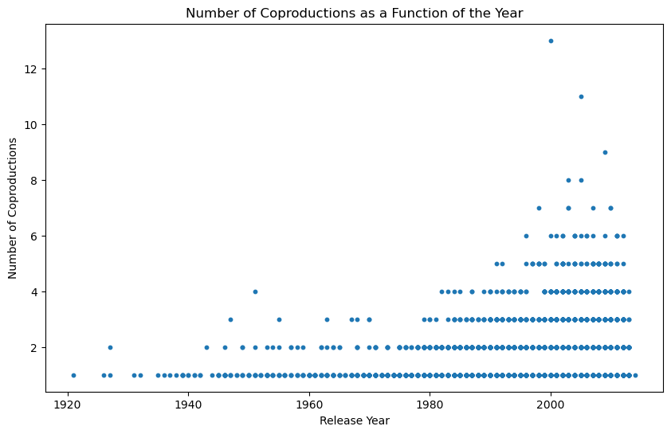

<meta http-equiv='cache-control' content='no-cache'> 
<meta http-equiv='expires' content='0'> 
<meta http-equiv='pragma' content='no-cache'>

```python
import pandas as pd
import numpy as np
import matplotlib.pyplot as plt
import seaborn as sns
import ast
from scipy import stats
import statsmodels.formula.api as smf
import networkx as nx
```


```python
## read the tsv files in MovieSummaries
load_movies = pd.read_csv('MovieSummaries/movie.metadata.tsv', sep = '\t', header = None)
load_character = pd.read_csv('MovieSummaries/character.metadata.tsv', sep = '\t', header = None)


```


```python
movies = load_movies.copy()
character = load_character.copy()

```


```python
# Make the name of the colum of movie: wikip_ID, freebase_ID, name, release date, box office, runtime, languages, countries, genres	
movies.columns = ['Wiki_ID', 'Freebase_ID', 'name', 'release_date', 'box_office', 'runtime', 'languages', 'countries', 'genres']
# Make the name of the columns of character wiki_ID, freebase_ID, character_name, actor_DOB, actor_gender, actor_height, actor_ethnicity, actor_name, actor_age, freebase_character_map
character.columns = ['Wiki_ID', 'Freebase_ID','release_date', 'character_name', 'actor_DOB', 'actor_gender', 'actor_height', 'actor_ethnicity', 'actor_name', 'actor_age', '10', '11', '12']
character = character.drop(['10', '11', '12'], axis = 1)
```


```python
## read grossed merged clean csv
gross = pd.read_csv('gross_merged_clean.csv')
gross
```


<div>
<style scoped>
    .dataframe tbody tr th:only-of-type {
        vertical-align: middle;
    }

    .dataframe tbody tr th {
        vertical-align: top;
    }

    .dataframe thead th {
        text-align: right;
    }
</style>
<table border="1" class="dataframe">
  <thead>
    <tr style="text-align: right;">
      <th></th>
      <th>tconst</th>
      <th>Wiki_ID</th>
      <th>Freebase_ID</th>
      <th>country</th>
      <th>movie</th>
      <th>gross</th>
    </tr>
  </thead>
  <tbody>
    <tr>
      <th>0</th>
      <td>tt0228333</td>
      <td>975900</td>
      <td>/m/03vyhn</td>
      <td>Domestic</td>
      <td>ghosts of mars</td>
      <td>8709640.0</td>
    </tr>
    <tr>
      <th>1</th>
      <td>tt0228333</td>
      <td>975900</td>
      <td>/m/03vyhn</td>
      <td>France</td>
      <td>ghosts of mars</td>
      <td>1937390.0</td>
    </tr>
    <tr>
      <th>2</th>
      <td>tt0228333</td>
      <td>975900</td>
      <td>/m/03vyhn</td>
      <td>Spain</td>
      <td>ghosts of mars</td>
      <td>509536.0</td>
    </tr>
    <tr>
      <th>3</th>
      <td>tt0228333</td>
      <td>975900</td>
      <td>/m/03vyhn</td>
      <td>Germany</td>
      <td>ghosts of mars</td>
      <td>496679.0</td>
    </tr>
    <tr>
      <th>4</th>
      <td>tt0228333</td>
      <td>975900</td>
      <td>/m/03vyhn</td>
      <td>United Kingdom</td>
      <td>ghosts of mars</td>
      <td>148898.0</td>
    </tr>
    <tr>
      <th>...</th>
      <td>...</td>
      <td>...</td>
      <td>...</td>
      <td>...</td>
      <td>...</td>
      <td>...</td>
    </tr>
    <tr>
      <th>90661</th>
      <td>tt0120202</td>
      <td>1918494</td>
      <td>/m/0660qx</td>
      <td>Denmark</td>
      <td>state and main</td>
      <td>13732.0</td>
    </tr>
    <tr>
      <th>90662</th>
      <td>tt0120202</td>
      <td>1918494</td>
      <td>/m/0660qx</td>
      <td>Australia</td>
      <td>state and main</td>
      <td>385631.0</td>
    </tr>
    <tr>
      <th>90663</th>
      <td>tt0107057</td>
      <td>664006</td>
      <td>/m/030xw6</td>
      <td>Domestic</td>
      <td>guilty as sin</td>
      <td>22866222.0</td>
    </tr>
    <tr>
      <th>90664</th>
      <td>tt1606259</td>
      <td>34980460</td>
      <td>/m/0g4pl34</td>
      <td>Domestic</td>
      <td>knuckle</td>
      <td>2647.0</td>
    </tr>
    <tr>
      <th>90665</th>
      <td>tt1606259</td>
      <td>34980460</td>
      <td>/m/0g4pl34</td>
      <td>United Kingdom</td>
      <td>knuckle</td>
      <td>22008.0</td>
    </tr>
  </tbody>
</table>
<p>90666 rows × 6 columns</p>
</div>


## Question 1

For The first question we will need the gross of the movies in the different region of the world, as well as their release year and their genre.


```python
movies_clean_gross = movies.copy()
gross_clean = gross.copy()

# Sum up the gross for each movie in the `gross` dataframe
gross_sum = gross_clean.groupby('Wiki_ID')['gross'].sum().reset_index()

# Merge this sum with the `movies` dataframe
movies_with_gross = movies_clean_gross.merge(gross_sum, on='Wiki_ID', how='left')

# Filter out rows where 'box_office' is not missing
non_missing_box_office = movies_with_gross.dropna(subset=['box_office'])


missing_percentage_before = movies_with_gross['box_office'].isna().sum() / len(movies_with_gross) * 100
print(f"Percentage of missing 'box_office' values before imputation: {missing_percentage_before:.2f}%")

# Check coherence for non-missing 'box_office' values
coherence_check = ((non_missing_box_office['box_office'] - non_missing_box_office['gross']).abs() / non_missing_box_office['box_office']).mean()
print(f"Average coherence deviation: {coherence_check:.2f}")

```

    Percentage of missing 'box_office' values before imputation: 89.72%
    Average coherence deviation: 0.34


There are a lot of box_office missing values, and for the ones we have, the summed gross differ from it by 34%, so replacing the Nans by the summed gross will not be accurate.

Instead, we should use the summed gross as the global box office for all the movies, and we can drop the box_office feature.


```python
movies_with_gross = movies_with_gross.drop(columns=['box_office'])
```


```python
# The release date of the movie is in the format of YYYY-MM-DD, we only need the year 
# so we split the date and only keep the year
movies_clean_release = movies_with_gross.copy()
movies_clean_release['release_date'] = movies_clean_release['release_date'].str[:4]
movies_clean_release['release_date'] = pd.to_numeric(movies_clean_release['release_date'], errors='coerce')
# Here the errors ignore is to keep the nan in the release date column
movies_clean_release['release_date'] = movies_clean_release['release_date'].astype(np.int64, errors='ignore')
```


```python
movies_clean_genre = movies_clean_release.copy()
movies_clean_genre['genres'] = movies_clean_genre['genres'].apply(lambda x: list(ast.literal_eval(x).values()))
# This line is to make the empty list to be nan so the nan are uniform
movies_clean_genre['genres'] = movies_clean_genre['genres'].apply(lambda x: x if len(x) != 0 else np.nan)

```


```python
gross_genre_release = gross_clean.copy()
#merge gross and movies_clean_genre on wiki_ID
gross_genre_release = gross_genre_release.merge(movies_clean_genre[['Wiki_ID', 'release_date', 'genres']], on = 'Wiki_ID', how = 'left')

```


```python
# count the numers of nan in genre
missing_genre_value = gross_genre_release.drop_duplicates(subset='Wiki_ID')['genres'].isna().sum()/gross_genre_release.drop_duplicates(subset='Wiki_ID')['genres'].shape[0]*100
print('The percentage of missing values in the genre column is {:.2f}%'.format(missing_genre_value))
```

    The percentage of missing values in the genre column is 0.14%


```python
number_of_genres = gross_genre_release.drop_duplicates(subset='Wiki_ID')['genres'].dropna().apply(lambda x: len(x))
# histogram of the number of genres
plt.figure(figsize=(10, 6))
plt.hist(number_of_genres,bins = np.arange(1, 20, 1)-0.5, edgecolor = 'black', linewidth = 1.2)
plt.xlabel('Number of Genres')
plt.xticks(np.arange(1, 20, 1))
plt.ylabel('Frequency')
plt.title('Histogram of the Number of Genres')
plt.show()
```


    

    


We have a very low percentage of genre missing we can therefore have a good analysis about this metric. We don't have any missing values for the release date because it was used as a key when merging the IMdB dataset with the CMU datset

## Question 3 


```python
movies_clean_country = movies_clean_genre.copy()
movies_clean_country['countries'] = movies_clean_country['countries'].apply(lambda x: list(ast.literal_eval(x).values()))
# This line is to make the empty list to be nan so the nan are uniform
movies_clean_country['countries'] = movies_clean_country['countries'].apply(lambda x: x if len(x) != 0 else np.nan)
```


```python
gross_country = gross_genre_release.copy()
#merge gross and movies_clean_genre on wiki_ID
gross_country = gross_country.merge(movies_clean_country[['Wiki_ID', 'countries']], on = 'Wiki_ID', how = 'left')
```


```python
# count the numers of nan in countries
missing_country_value = gross_country.drop_duplicates(subset='Wiki_ID')['countries'].isna().sum()/gross_country.drop_duplicates(subset='Wiki_ID')['countries'].shape[0]*100
print('The percentage of missing values in the countries column is {:.2f}%'.format(missing_country_value))
```

    The percentage of missing values in the countries column is 1.70%


```python
coprood_count = gross_country.dropna(subset='countries')
coprood_count = coprood_count.drop_duplicates(subset='Wiki_ID')[coprood_count['countries'].apply(lambda x: len(x)) > 1].shape[0]/gross_country.drop_duplicates(subset='Wiki_ID')['countries'].shape[0]*100

print('The number of movies that are co-produced by more than one country is {:.2f}%'.format(coprood_count))
```

    The number of movies that are co-produced by more than one country is 24.98%


    C:\Users\marcp\AppData\Local\Temp\ipykernel_35584\30425266.py:2: UserWarning: Boolean Series key will be reindexed to match DataFrame index.
      coprood_count = coprood_count.drop_duplicates(subset='Wiki_ID')[coprood_count['countries'].apply(lambda x: len(x)) > 1].shape[0]/gross_country.drop_duplicates(subset='Wiki_ID')['countries'].shape[0]*100


```python
number_of_countries = gross_country.drop_duplicates(subset='Wiki_ID')['countries'].dropna().apply(lambda x: len(x))
# histogram of the number of production countries
plt.figure(figsize=(10, 6))
plt.hist(number_of_countries,bins = np.arange(1, 15, 1)-0.5, edgecolor = 'black', linewidth = 1.2)
plt.xlabel('Number of Countries')
plt.xticks(np.arange(1, 15, 1))
plt.yscale('log')
plt.ylabel('Frequency (log)')
plt.title('Histogram of the Number of Countries')
plt.show()
```


    

    


We have a very low percentage of countries missing we can therefore have a good analysis about this metric. And the level of co-production is relatively high so it will still make sense to do our analysis.

## Question 4

For the gender representation in the movie. We decided to only use the values that were given for each of the movies, making the assumption that if the gender of an actor is not given the character was probably a small part. 


```python
# go in the character dataset and find the percentage of gender F in each movie
character_gender = character.copy()

#count the number of "F" for each wiki_ID in character_gender
# groupby wiki_ID and count the number of "F" in each group
character_groupby = character_gender.groupby('Wiki_ID')
character_groupby_tot = character_groupby["actor_gender"].count()
character_groupby_F = character_groupby.apply(lambda x: (x['actor_gender'] == 'F').sum())
ratio_female_to_total = character_groupby_F / character_groupby_tot


```


```python
data = {
    'Wiki_ID': ratio_female_to_total.index,
    'Ratio_Female_to_Total': ratio_female_to_total.values,
    'num_female': character_groupby_F.values,
    'num_male': character_groupby_tot.values - character_groupby_F.values
}

# Create DataFrame
df_ratio = pd.DataFrame(data)

# Reset the index to make it 1-dimensional
df_ratio.reset_index(drop=True, inplace=True)
```


```python
movies_clean_gender = movies_clean_country.copy()
movies_clean_gender = movies_clean_gender.merge(df_ratio, on = 'Wiki_ID', how = 'left')
movies_clean_gender.head()
```


<div>
<style scoped>
    .dataframe tbody tr th:only-of-type {
        vertical-align: middle;
    }

    .dataframe tbody tr th {
        vertical-align: top;
    }

    .dataframe thead th {
        text-align: right;
    }
</style>
<table border="1" class="dataframe">
  <thead>
    <tr style="text-align: right;">
      <th></th>
      <th>Wiki_ID</th>
      <th>Freebase_ID</th>
      <th>name</th>
      <th>release_date</th>
      <th>runtime</th>
      <th>languages</th>
      <th>countries</th>
      <th>genres</th>
      <th>gross</th>
      <th>Ratio_Female_to_Total</th>
      <th>num_female</th>
      <th>num_male</th>
    </tr>
  </thead>
  <tbody>
    <tr>
      <th>0</th>
      <td>975900</td>
      <td>/m/03vyhn</td>
      <td>Ghosts of Mars</td>
      <td>2001.0</td>
      <td>98.0</td>
      <td>{"/m/02h40lc": "English Language"}</td>
      <td>[United States of America]</td>
      <td>[Thriller, Science Fiction, Horror, Adventure,...</td>
      <td>11996794.0</td>
      <td>0.352941</td>
      <td>6.0</td>
      <td>11.0</td>
    </tr>
    <tr>
      <th>1</th>
      <td>3196793</td>
      <td>/m/08yl5d</td>
      <td>Getting Away with Murder: The JonBenét Ramsey ...</td>
      <td>2000.0</td>
      <td>95.0</td>
      <td>{"/m/02h40lc": "English Language"}</td>
      <td>[United States of America]</td>
      <td>[Mystery, Biographical film, Drama, Crime Drama]</td>
      <td>NaN</td>
      <td>0.266667</td>
      <td>4.0</td>
      <td>11.0</td>
    </tr>
    <tr>
      <th>2</th>
      <td>28463795</td>
      <td>/m/0crgdbh</td>
      <td>Brun bitter</td>
      <td>1988.0</td>
      <td>83.0</td>
      <td>{"/m/05f_3": "Norwegian Language"}</td>
      <td>[Norway]</td>
      <td>[Crime Fiction, Drama]</td>
      <td>NaN</td>
      <td>0.500000</td>
      <td>2.0</td>
      <td>2.0</td>
    </tr>
    <tr>
      <th>3</th>
      <td>9363483</td>
      <td>/m/0285_cd</td>
      <td>White Of The Eye</td>
      <td>1987.0</td>
      <td>110.0</td>
      <td>{"/m/02h40lc": "English Language"}</td>
      <td>[United Kingdom]</td>
      <td>[Thriller, Erotic thriller, Psychological thri...</td>
      <td>NaN</td>
      <td>0.500000</td>
      <td>1.0</td>
      <td>1.0</td>
    </tr>
    <tr>
      <th>4</th>
      <td>261236</td>
      <td>/m/01mrr1</td>
      <td>A Woman in Flames</td>
      <td>1983.0</td>
      <td>106.0</td>
      <td>{"/m/04306rv": "German Language"}</td>
      <td>[Germany]</td>
      <td>[Drama]</td>
      <td>NaN</td>
      <td>0.333333</td>
      <td>1.0</td>
      <td>2.0</td>
    </tr>
  </tbody>
</table>
</div>


```python
gross_gender = gross_country.copy()
#merge gross and movies_clean_genre on wiki_ID
gross_gender = gross_gender.merge(movies_clean_gender[['Wiki_ID', 'Ratio_Female_to_Total', 'num_female', 'num_male']], on = 'Wiki_ID', how = 'left')
gross_gender
```


<div>
<style scoped>
    .dataframe tbody tr th:only-of-type {
        vertical-align: middle;
    }

    .dataframe tbody tr th {
        vertical-align: top;
    }

    .dataframe thead th {
        text-align: right;
    }
</style>
<table border="1" class="dataframe">
  <thead>
    <tr style="text-align: right;">
      <th></th>
      <th>tconst</th>
      <th>Wiki_ID</th>
      <th>Freebase_ID</th>
      <th>country</th>
      <th>movie</th>
      <th>gross</th>
      <th>release_date</th>
      <th>genres</th>
      <th>countries</th>
      <th>Ratio_Female_to_Total</th>
      <th>num_female</th>
      <th>num_male</th>
    </tr>
  </thead>
  <tbody>
    <tr>
      <th>0</th>
      <td>tt0228333</td>
      <td>975900</td>
      <td>/m/03vyhn</td>
      <td>Domestic</td>
      <td>ghosts of mars</td>
      <td>8709640.0</td>
      <td>2001.0</td>
      <td>[Thriller, Science Fiction, Horror, Adventure,...</td>
      <td>[United States of America]</td>
      <td>0.352941</td>
      <td>6.0</td>
      <td>11.0</td>
    </tr>
    <tr>
      <th>1</th>
      <td>tt0228333</td>
      <td>975900</td>
      <td>/m/03vyhn</td>
      <td>France</td>
      <td>ghosts of mars</td>
      <td>1937390.0</td>
      <td>2001.0</td>
      <td>[Thriller, Science Fiction, Horror, Adventure,...</td>
      <td>[United States of America]</td>
      <td>0.352941</td>
      <td>6.0</td>
      <td>11.0</td>
    </tr>
    <tr>
      <th>2</th>
      <td>tt0228333</td>
      <td>975900</td>
      <td>/m/03vyhn</td>
      <td>Spain</td>
      <td>ghosts of mars</td>
      <td>509536.0</td>
      <td>2001.0</td>
      <td>[Thriller, Science Fiction, Horror, Adventure,...</td>
      <td>[United States of America]</td>
      <td>0.352941</td>
      <td>6.0</td>
      <td>11.0</td>
    </tr>
    <tr>
      <th>3</th>
      <td>tt0228333</td>
      <td>975900</td>
      <td>/m/03vyhn</td>
      <td>Germany</td>
      <td>ghosts of mars</td>
      <td>496679.0</td>
      <td>2001.0</td>
      <td>[Thriller, Science Fiction, Horror, Adventure,...</td>
      <td>[United States of America]</td>
      <td>0.352941</td>
      <td>6.0</td>
      <td>11.0</td>
    </tr>
    <tr>
      <th>4</th>
      <td>tt0228333</td>
      <td>975900</td>
      <td>/m/03vyhn</td>
      <td>United Kingdom</td>
      <td>ghosts of mars</td>
      <td>148898.0</td>
      <td>2001.0</td>
      <td>[Thriller, Science Fiction, Horror, Adventure,...</td>
      <td>[United States of America]</td>
      <td>0.352941</td>
      <td>6.0</td>
      <td>11.0</td>
    </tr>
    <tr>
      <th>...</th>
      <td>...</td>
      <td>...</td>
      <td>...</td>
      <td>...</td>
      <td>...</td>
      <td>...</td>
      <td>...</td>
      <td>...</td>
      <td>...</td>
      <td>...</td>
      <td>...</td>
      <td>...</td>
    </tr>
    <tr>
      <th>90661</th>
      <td>tt0120202</td>
      <td>1918494</td>
      <td>/m/0660qx</td>
      <td>Denmark</td>
      <td>state and main</td>
      <td>13732.0</td>
      <td>2000.0</td>
      <td>[Parody, Americana, Comedy]</td>
      <td>[France, United States of America]</td>
      <td>0.181818</td>
      <td>4.0</td>
      <td>18.0</td>
    </tr>
    <tr>
      <th>90662</th>
      <td>tt0120202</td>
      <td>1918494</td>
      <td>/m/0660qx</td>
      <td>Australia</td>
      <td>state and main</td>
      <td>385631.0</td>
      <td>2000.0</td>
      <td>[Parody, Americana, Comedy]</td>
      <td>[France, United States of America]</td>
      <td>0.181818</td>
      <td>4.0</td>
      <td>18.0</td>
    </tr>
    <tr>
      <th>90663</th>
      <td>tt0107057</td>
      <td>664006</td>
      <td>/m/030xw6</td>
      <td>Domestic</td>
      <td>guilty as sin</td>
      <td>22866222.0</td>
      <td>1993.0</td>
      <td>[Thriller, Erotic thriller, Psychological thri...</td>
      <td>[United States of America]</td>
      <td>0.375000</td>
      <td>3.0</td>
      <td>5.0</td>
    </tr>
    <tr>
      <th>90664</th>
      <td>tt1606259</td>
      <td>34980460</td>
      <td>/m/0g4pl34</td>
      <td>Domestic</td>
      <td>knuckle</td>
      <td>2647.0</td>
      <td>2011.0</td>
      <td>[Biographical film, Drama, Documentary]</td>
      <td>[Ireland, United Kingdom]</td>
      <td>NaN</td>
      <td>NaN</td>
      <td>NaN</td>
    </tr>
    <tr>
      <th>90665</th>
      <td>tt1606259</td>
      <td>34980460</td>
      <td>/m/0g4pl34</td>
      <td>United Kingdom</td>
      <td>knuckle</td>
      <td>22008.0</td>
      <td>2011.0</td>
      <td>[Biographical film, Drama, Documentary]</td>
      <td>[Ireland, United Kingdom]</td>
      <td>NaN</td>
      <td>NaN</td>
      <td>NaN</td>
    </tr>
  </tbody>
</table>
<p>90666 rows × 12 columns</p>
</div>


```python
# Analyzing Ethnicity Data
print(f"Total entries in character dataframe: {len(character)}")

# Check for missing values in 'actor_ethnicity'
missing_ethnicity = character['actor_ethnicity'].isna().sum()
print(f"Number of missing values in 'actor_ethnicity': {missing_ethnicity}")
print(f"Percentage of missing values in 'actor_ethnicity': {missing_ethnicity / len(character) * 100:.2f}%")
```

    Total entries in character dataframe: 450669
    Number of missing values in 'actor_ethnicity': 344611
    Percentage of missing values in 'actor_ethnicity': 76.47%


```python
#Filling Nan with 'Unknown' ethnicity
character_ethnicity = character_gender.copy()
character_ethnicity['actor_ethnicity'] = character_ethnicity['actor_ethnicity']

# Analyzing ethnicity distribution
ethnicity_distribution = character['actor_ethnicity'].value_counts(normalize=True) * 100
print(ethnicity_distribution)
```

    actor_ethnicity
    /m/0dryh9k    15.417036
    /m/0x67        9.578721
    /m/041rx       9.542892
    /m/02w7gg      5.812857
    /m/033tf_      3.636689
                    ...    
    /m/043_z22     0.000943
    /m/03x_fq7     0.000943
    /m/01hphz      0.000943
    /m/033fjj      0.000943
    /m/013y54      0.000943
    Name: proportion, Length: 479, dtype: float64


We have the distribution of the ethnicities, but they are encoded as ids. Lets decode them :


```python
# Load the CSV file into a DataFrame
ethnicity_labels_df = pd.read_csv('./dictionnaries/ethnicity_labels.csv')

# Convert the DataFrame to a dictionary
ethnicity_labels = dict(zip(ethnicity_labels_df['Freebase ID'], ethnicity_labels_df['Ethnicity Label']))

# Replace the codes in 'ethnicity_distribution' with their labels
ethnicity_distribution_labeled = ethnicity_distribution.rename(index=ethnicity_labels)

# Print the updated distribution
print(ethnicity_distribution_labeled)
```

    actor_ethnicity
    Indian person             15.417036
    African Americans          9.578721
    Jewish people              9.542892
    English people             5.812857
    Irish Americans            3.636689
                                ...    
    /m/043_z22                 0.000943
    Aboriginal Australians     0.000943
    Indian diaspora            0.000943
    Ho-Chunk                   0.000943
    Han Chinese people         0.000943
    Name: proportion, Length: 479, dtype: float64


We can see that some ethnicities aren't translated. Lets analyse them.


```python
# Identifying untranslated ethnicity codes
untranslated_codes = set(character_ethnicity['actor_ethnicity']) - set(ethnicity_labels.keys())
untranslated_codes = {code for code in untranslated_codes if isinstance(code, str)}  # Ensure that NaNs are not included

# Counting the number of untranslated ethnicities
untranslated_counts = character_ethnicity['actor_ethnicity'].apply(lambda x: x if x in untranslated_codes else np.nan).value_counts()

character_ethnicity_df = character_ethnicity.copy()

# Find the most common untranslated ethnicity
if not untranslated_counts.empty:
    most_common_untranslated = untranslated_counts.idxmax()
    most_common_untranslated_count = untranslated_counts.max()
    print(f"Most common untranslated ethnicity: {most_common_untranslated} ({most_common_untranslated_count} occurrences)")

    print("Five most common untranslated ethnicities:")
    print(untranslated_counts.head(5))

else:
    print("No untranslated ethnicity codes found.")
```

    Most common untranslated ethnicity: /m/044038p (1885 occurrences)
    Five most common untranslated ethnicities:
    actor_ethnicity
    /m/044038p    1885
    /m/02p1pl6     200
    /m/04tvpv      197
    /m/02p656s     121
    /m/0283js_      81
    Name: count, dtype: int64


There are 1885 actors with ethnicity '/m/044038p'. Lets see who they are.


```python
# Filter for actors with the specified ethnicity code
actors_with_specific_ethnicity = character_ethnicity[character_ethnicity['actor_ethnicity'] == '/m/044038p']

# Select 10 actors from this group
sample_actors = actors_with_specific_ethnicity.sample(10)

# Print the selected actors
print(sample_actors[['actor_name', 'actor_ethnicity']])
```

                    actor_name actor_ethnicity
    93539              Ron Lea      /m/044038p
    132927       Chelsea Hobbs      /m/044038p
    435568         Daniel Kash      /m/044038p
    330269     Brennan Elliott      /m/044038p
    351243  Natasha Henstridge      /m/044038p
    273498          David Kaye      /m/044038p
    257387       Kenneth Welsh      /m/044038p
    218405        Ryan Gosling      /m/044038p
    292989       Nathan Bexton      /m/044038p
    32720           Len Cariou      /m/044038p


Those 10 actors are all canadians. We will call this ethnicity 'Canadians'.


```python
# Define a function to replace unknown ethnicities
def replace_unknown_ethnicities(ethnicity):
    if ethnicity == '/m/044038p':
        return 'Canadians'
    elif not ethnicity in ethnicity_labels.keys():
        return 'Unknown'
    else:
        return ethnicity

# Apply the function to the actor_ethnicity column
character_ethnicity['actor_ethnicity'] = character_ethnicity['actor_ethnicity'].apply(replace_unknown_ethnicities)

print(character_ethnicity.head())
```

       Wiki_ID Freebase_ID release_date              character_name   actor_DOB  \
    0   975900   /m/03vyhn   2001-08-24                    Akooshay  1958-08-26   
    1   975900   /m/03vyhn   2001-08-24  Lieutenant Melanie Ballard  1974-08-15   
    2   975900   /m/03vyhn   2001-08-24         Desolation Williams  1969-06-15   
    3   975900   /m/03vyhn   2001-08-24          Sgt Jericho Butler  1967-09-12   
    4   975900   /m/03vyhn   2001-08-24             Bashira Kincaid  1977-09-25   
    
      actor_gender  actor_height actor_ethnicity          actor_name  actor_age  
    0            F         1.620         Unknown      Wanda De Jesus       42.0  
    1            F         1.780       Canadians  Natasha Henstridge       27.0  
    2            M         1.727         /m/0x67            Ice Cube       32.0  
    3            M         1.750         Unknown       Jason Statham       33.0  
    4            F         1.650         Unknown         Clea DuVall       23.0  


```python
# Replace 'Unknown' with np.nan in the actor_ethnicity column
character_ethnicity['actor_ethnicity'] = character_ethnicity['actor_ethnicity'].replace('Unknown', np.nan)

# Optionally, print a few rows to verify the changes
print(character_ethnicity.head())
```

       Wiki_ID Freebase_ID release_date              character_name   actor_DOB  \
    0   975900   /m/03vyhn   2001-08-24                    Akooshay  1958-08-26   
    1   975900   /m/03vyhn   2001-08-24  Lieutenant Melanie Ballard  1974-08-15   
    2   975900   /m/03vyhn   2001-08-24         Desolation Williams  1969-06-15   
    3   975900   /m/03vyhn   2001-08-24          Sgt Jericho Butler  1967-09-12   
    4   975900   /m/03vyhn   2001-08-24             Bashira Kincaid  1977-09-25   
    
      actor_gender  actor_height actor_ethnicity          actor_name  actor_age  
    0            F         1.620             NaN      Wanda De Jesus       42.0  
    1            F         1.780       Canadians  Natasha Henstridge       27.0  
    2            M         1.727         /m/0x67            Ice Cube       32.0  
    3            M         1.750             NaN       Jason Statham       33.0  
    4            F         1.650             NaN         Clea DuVall       23.0  


```python
def extract_languages(lang_str):
    if pd.isna(lang_str):
        return ['Unknown']
    try:
        # Parse the string as a dictionary
        lang_dict = ast.literal_eval(lang_str)
        # Extract the language names and remove 'Language' from the end
        languages = [lang.split(' Language')[0] for lang in lang_dict.values()]

        return languages
    except ValueError:
        # Handle cases where lang_str cannot be parsed
        return ['Unknown']

movies_clean_languages = movies_clean_country.copy()
movies_clean_languages['languages'] = movies_clean_languages['languages'].apply(extract_languages)

# Counting languages
language_counts = pd.Series([lang for sublist in movies_clean_languages['languages'] for lang in sublist]).value_counts()
print(language_counts)
```

    English                                 40891
    Hindi                                    3744
    Spanish                                  3673
    French                                   3422
    Silent film                              3183
                                            ...  
    Southwestern Mandarin                       1
    Australian Aboriginal Pidgin English        1
    Krio                                        1
    Pawnee                                      1
    Kuna language                               1
    Name: count, Length: 205, dtype: int64


```python
gross_language = gross_gender.copy()
#merge gross_gender and movies_clean_language on wiki_ID
gross_language = gross_language.merge(movies_clean_languages[['Wiki_ID', 'languages']], on = 'Wiki_ID', how = 'left')
```


```python
# Count the number of movies with more than one language
multilingual_movies = movies_clean_languages['languages'].apply(lambda x: len(x) > 1)

print(f"Number of multilingual movies: {multilingual_movies.sum()} over {len(multilingual_movies)} movies.")
print(movies_clean_languages['languages'][multilingual_movies].head())
```

    Number of multilingual movies: 9807 over 81741 movies.
    5     [Silent film, English]
    48    [Silent film, English]
    49      [Afrikaans, English]
    51    [Silent film, English]
    52    [Silent film, English]
    Name: languages, dtype: object


```python
# Creating a new dataframe for multilingual movies for language combination analysis
multilingual_combinations_df = movies_clean_languages.copy()
multilingual_combinations_df = multilingual_combinations_df[multilingual_combinations_df['languages'].apply(lambda x: len(x) > 1 and 'Unknown' not in x)]

# Create a distinct identifier for each multilingual language combination
multilingual_combinations_df['multilingual_combination'] = multilingual_combinations_df['languages'].apply(lambda x: '-'.join(sorted(x)))

# Count the occurrences of each multilingual language combination
multilingual_combination_counts = multilingual_combinations_df['multilingual_combination'].value_counts()
print("Most common multilingual language combinations:")
print(multilingual_combination_counts.head())  # Adjust the number of combinations to display as needed

```

    Most common multilingual language combinations:
    multilingual_combination
    English-Silent film    2297
    English-French          522
    English-Spanish         506
    English-Italian         278
    English-German          264
    Name: count, dtype: int64


```python
number_of_languages = movies_clean_languages.drop_duplicates(subset='Wiki_ID')['languages'].dropna().apply(lambda x: len(x))
# histogram of the number of genres
plt.figure(figsize=(10, 6))
plt.hist(number_of_languages,bins = np.arange(1, 15, 1)-0.5, edgecolor = 'black', linewidth = 1.2)
plt.xlabel('Number of Languages')
plt.xticks(np.arange(1, 15, 1))
plt.ylabel('Frequency (log)')
plt.yscale('log')
plt.title('Histogram of the Number of Languages')
plt.show()
```


    

    


# Analysis


```python
df_analysis = gross_language.copy()

# Load the CSV mapping into a pandas DataFrame
country_mapping_df = pd.read_csv('dictionnaries/country_mapping.csv')

# Ensure the 'Country_mapped' column is a list (it should be already based on your CSV content)
country_mapping_df['Country_mapped'] = country_mapping_df['Country_mapped'].apply(eval)

# Create a dictionary from the DataFrame for mapping
country_mapping_dict = pd.Series(country_mapping_df['Country_mapped'].values, index=country_mapping_df['Country']).to_dict()

# Define a function to map countries
def map_country(country):
    # Get the mapped value(s) from the dictionary
    mapped_values = country_mapping_dict.get(country, [country])
    return mapped_values

# Apply the function to the 'country' column
# This will create a series of lists, which we then explode into separate rows
df_analysis['country'] = df_analysis['country'].apply(map_country)

```


```python
df_analysis.head()
```


<div>
<style scoped>
    .dataframe tbody tr th:only-of-type {
        vertical-align: middle;
    }

    .dataframe tbody tr th {
        vertical-align: top;
    }

    .dataframe thead th {
        text-align: right;
    }
</style>
<table border="1" class="dataframe">
  <thead>
    <tr style="text-align: right;">
      <th></th>
      <th>tconst</th>
      <th>Wiki_ID</th>
      <th>Freebase_ID</th>
      <th>country</th>
      <th>movie</th>
      <th>gross</th>
      <th>release_date</th>
      <th>genres</th>
      <th>countries</th>
      <th>Ratio_Female_to_Total</th>
      <th>num_female</th>
      <th>num_male</th>
      <th>languages</th>
    </tr>
  </thead>
  <tbody>
    <tr>
      <th>0</th>
      <td>tt0228333</td>
      <td>975900</td>
      <td>/m/03vyhn</td>
      <td>[United States of America, Canada]</td>
      <td>ghosts of mars</td>
      <td>8709640.0</td>
      <td>2001.0</td>
      <td>[Thriller, Science Fiction, Horror, Adventure,...</td>
      <td>[United States of America]</td>
      <td>0.352941</td>
      <td>6.0</td>
      <td>11.0</td>
      <td>[English]</td>
    </tr>
    <tr>
      <th>1</th>
      <td>tt0228333</td>
      <td>975900</td>
      <td>/m/03vyhn</td>
      <td>[France]</td>
      <td>ghosts of mars</td>
      <td>1937390.0</td>
      <td>2001.0</td>
      <td>[Thriller, Science Fiction, Horror, Adventure,...</td>
      <td>[United States of America]</td>
      <td>0.352941</td>
      <td>6.0</td>
      <td>11.0</td>
      <td>[English]</td>
    </tr>
    <tr>
      <th>2</th>
      <td>tt0228333</td>
      <td>975900</td>
      <td>/m/03vyhn</td>
      <td>[Spain]</td>
      <td>ghosts of mars</td>
      <td>509536.0</td>
      <td>2001.0</td>
      <td>[Thriller, Science Fiction, Horror, Adventure,...</td>
      <td>[United States of America]</td>
      <td>0.352941</td>
      <td>6.0</td>
      <td>11.0</td>
      <td>[English]</td>
    </tr>
    <tr>
      <th>3</th>
      <td>tt0228333</td>
      <td>975900</td>
      <td>/m/03vyhn</td>
      <td>[Germany]</td>
      <td>ghosts of mars</td>
      <td>496679.0</td>
      <td>2001.0</td>
      <td>[Thriller, Science Fiction, Horror, Adventure,...</td>
      <td>[United States of America]</td>
      <td>0.352941</td>
      <td>6.0</td>
      <td>11.0</td>
      <td>[English]</td>
    </tr>
    <tr>
      <th>4</th>
      <td>tt0228333</td>
      <td>975900</td>
      <td>/m/03vyhn</td>
      <td>[United Kingdom]</td>
      <td>ghosts of mars</td>
      <td>148898.0</td>
      <td>2001.0</td>
      <td>[Thriller, Science Fiction, Horror, Adventure,...</td>
      <td>[United States of America]</td>
      <td>0.352941</td>
      <td>6.0</td>
      <td>11.0</td>
      <td>[English]</td>
    </tr>
  </tbody>
</table>
</div>


```python
df_home_country  = df_analysis.copy()

print(df_home_country.iloc[213])
def is_home_country(row):
    return any(c in row['countries'] for c in row['country'])

# Sum up the gross for each movie in the `gross` dataframe
gross_sum = df_home_country.groupby('Wiki_ID')['gross'].sum().reset_index()
gross_sum.columns = ['Wiki_ID', 'total_gross']
# Merge this sum with the `movies` dataframe
df_home_country = df_home_country.merge(gross_sum, on='Wiki_ID', how='left')


df_home_country.dropna(subset=['countries'], inplace=True)
is_home = df_home_country.apply(is_home_country, axis=1)
df_home_country = df_home_country[is_home]

print(df_home_country.head())

df_home_country["ratio_of_home_country"] = df_home_country["gross"] / df_home_country["total_gross"]
df_home_country.head()

```

    tconst                                              tt0380349
    Wiki_ID                                              35923481
    Freebase_ID                                        /m/0jwwwz2
    country                                              [France]
    movie                                         l'enquete corse
    gross                                              17755607.0
    release_date                                           2004.0
    genres                   [Crime Fiction, Comedy film, Action]
    countries                                                 NaN
    Ratio_Female_to_Total                                     NaN
    num_female                                                NaN
    num_male                                                  NaN
    languages                                                  []
    Name: 213, dtype: object
           tconst   Wiki_ID Freebase_ID                             country  \
    0   tt0228333    975900   /m/03vyhn  [United States of America, Canada]   
    8   tt0058331     77856    /m/0kcn7  [United States of America, Canada]   
    17  tt0892904  21926710  /m/05p45cv  [United States of America, Canada]   
    18  tt0255819    156558   /m/014k4y  [United States of America, Canada]   
    25  tt0405393  12008535  /m/02vlsqt  [United States of America, Canada]   
    
                 movie        gross  release_date  \
    0   ghosts of mars    8709640.0        2001.0   
    8     mary poppins  102272727.0        1964.0   
    17   white on rice      69171.0        2009.0   
    18        baby boy   28734552.0        2001.0   
    25    rudo y cursi    1827660.0        2008.0   
    
                                                   genres  \
    0   [Thriller, Science Fiction, Horror, Adventure,...   
    8   [Children's/Family, Musical, Fantasy, Comedy, ...   
    17     [Romantic comedy, Romance Film, Comedy, Indie]   
    18              [Crime Fiction, Drama, Coming of age]   
    25  [Sports, Drama, Family Drama, Comedy-drama, Co...   
    
                                 countries  Ratio_Female_to_Total  num_female  \
    0           [United States of America]               0.352941         6.0   
    8           [United States of America]               0.461538         6.0   
    17          [United States of America]               0.555556         5.0   
    18          [United States of America]               0.521739        12.0   
    25  [Mexico, United States of America]               0.375000         3.0   
    
        num_male  languages  total_gross  
    0       11.0  [English]   11996794.0  
    8        7.0  [English]  103078757.0  
    17       4.0         []      69171.0  
    18      11.0  [English]   28907684.0  
    25       5.0  [Spanish]   11169232.0  


<div>
<style scoped>
    .dataframe tbody tr th:only-of-type {
        vertical-align: middle;
    }

    .dataframe tbody tr th {
        vertical-align: top;
    }

    .dataframe thead th {
        text-align: right;
    }
</style>
<table border="1" class="dataframe">
  <thead>
    <tr style="text-align: right;">
      <th></th>
      <th>tconst</th>
      <th>Wiki_ID</th>
      <th>Freebase_ID</th>
      <th>country</th>
      <th>movie</th>
      <th>gross</th>
      <th>release_date</th>
      <th>genres</th>
      <th>countries</th>
      <th>Ratio_Female_to_Total</th>
      <th>num_female</th>
      <th>num_male</th>
      <th>languages</th>
      <th>total_gross</th>
      <th>ratio_of_home_country</th>
    </tr>
  </thead>
  <tbody>
    <tr>
      <th>0</th>
      <td>tt0228333</td>
      <td>975900</td>
      <td>/m/03vyhn</td>
      <td>[United States of America, Canada]</td>
      <td>ghosts of mars</td>
      <td>8709640.0</td>
      <td>2001.0</td>
      <td>[Thriller, Science Fiction, Horror, Adventure,...</td>
      <td>[United States of America]</td>
      <td>0.352941</td>
      <td>6.0</td>
      <td>11.0</td>
      <td>[English]</td>
      <td>11996794.0</td>
      <td>0.725997</td>
    </tr>
    <tr>
      <th>8</th>
      <td>tt0058331</td>
      <td>77856</td>
      <td>/m/0kcn7</td>
      <td>[United States of America, Canada]</td>
      <td>mary poppins</td>
      <td>102272727.0</td>
      <td>1964.0</td>
      <td>[Children's/Family, Musical, Fantasy, Comedy, ...</td>
      <td>[United States of America]</td>
      <td>0.461538</td>
      <td>6.0</td>
      <td>7.0</td>
      <td>[English]</td>
      <td>103078757.0</td>
      <td>0.992180</td>
    </tr>
    <tr>
      <th>17</th>
      <td>tt0892904</td>
      <td>21926710</td>
      <td>/m/05p45cv</td>
      <td>[United States of America, Canada]</td>
      <td>white on rice</td>
      <td>69171.0</td>
      <td>2009.0</td>
      <td>[Romantic comedy, Romance Film, Comedy, Indie]</td>
      <td>[United States of America]</td>
      <td>0.555556</td>
      <td>5.0</td>
      <td>4.0</td>
      <td>[]</td>
      <td>69171.0</td>
      <td>1.000000</td>
    </tr>
    <tr>
      <th>18</th>
      <td>tt0255819</td>
      <td>156558</td>
      <td>/m/014k4y</td>
      <td>[United States of America, Canada]</td>
      <td>baby boy</td>
      <td>28734552.0</td>
      <td>2001.0</td>
      <td>[Crime Fiction, Drama, Coming of age]</td>
      <td>[United States of America]</td>
      <td>0.521739</td>
      <td>12.0</td>
      <td>11.0</td>
      <td>[English]</td>
      <td>28907684.0</td>
      <td>0.994011</td>
    </tr>
    <tr>
      <th>25</th>
      <td>tt0405393</td>
      <td>12008535</td>
      <td>/m/02vlsqt</td>
      <td>[United States of America, Canada]</td>
      <td>rudo y cursi</td>
      <td>1827660.0</td>
      <td>2008.0</td>
      <td>[Sports, Drama, Family Drama, Comedy-drama, Co...</td>
      <td>[Mexico, United States of America]</td>
      <td>0.375000</td>
      <td>3.0</td>
      <td>5.0</td>
      <td>[Spanish]</td>
      <td>11169232.0</td>
      <td>0.163633</td>
    </tr>
  </tbody>
</table>
</div>


```python
# Define the aggregation
aggregations = {
    'gross': 'sum',
    'ratio_of_home_country': 'sum',
    'country': 'sum'
}
all_agg = {col: 'first' for col in df_home_country.columns if col not in aggregations and col != "Wiki_ID"}
all_agg.update(aggregations)


df_home_country_combined = df_home_country.groupby('Wiki_ID').agg(all_agg).reset_index()
df_home_country_combined.head()

```


<div>
<style scoped>
    .dataframe tbody tr th:only-of-type {
        vertical-align: middle;
    }

    .dataframe tbody tr th {
        vertical-align: top;
    }

    .dataframe thead th {
        text-align: right;
    }
</style>
<table border="1" class="dataframe">
  <thead>
    <tr style="text-align: right;">
      <th></th>
      <th>Wiki_ID</th>
      <th>tconst</th>
      <th>Freebase_ID</th>
      <th>movie</th>
      <th>release_date</th>
      <th>genres</th>
      <th>countries</th>
      <th>Ratio_Female_to_Total</th>
      <th>num_female</th>
      <th>num_male</th>
      <th>languages</th>
      <th>total_gross</th>
      <th>gross</th>
      <th>ratio_of_home_country</th>
      <th>country</th>
    </tr>
  </thead>
  <tbody>
    <tr>
      <th>0</th>
      <td>3217</td>
      <td>tt0106308</td>
      <td>/m/014hr</td>
      <td>army of darkness</td>
      <td>1992.0</td>
      <td>[Cult, Horror, Stop motion, Costume drama, Act...</td>
      <td>[United States of America]</td>
      <td>0.230769</td>
      <td>3.0</td>
      <td>10.0</td>
      <td>[English]</td>
      <td>11505925.0</td>
      <td>11502976.0</td>
      <td>0.999744</td>
      <td>[United States of America, Canada]</td>
    </tr>
    <tr>
      <th>1</th>
      <td>3746</td>
      <td>tt0083658</td>
      <td>/m/017n9</td>
      <td>blade runner</td>
      <td>1982.0</td>
      <td>[Thriller, Cyberpunk, Science Fiction, Future ...</td>
      <td>[United States of America, Hong Kong]</td>
      <td>0.214286</td>
      <td>3.0</td>
      <td>11.0</td>
      <td>[Japanese, Cantonese, English, German, Hungari...</td>
      <td>40877529.0</td>
      <td>32914489.0</td>
      <td>0.805198</td>
      <td>[United States of America, Canada]</td>
    </tr>
    <tr>
      <th>2</th>
      <td>3837</td>
      <td>tt0071230</td>
      <td>/m/018f8</td>
      <td>blazing saddles</td>
      <td>1974.0</td>
      <td>[Western, Satire, Comedy]</td>
      <td>[United States of America]</td>
      <td>0.100000</td>
      <td>2.0</td>
      <td>18.0</td>
      <td>[Yiddish, English]</td>
      <td>119617265.0</td>
      <td>119616663.0</td>
      <td>0.999995</td>
      <td>[United States of America, Canada]</td>
    </tr>
    <tr>
      <th>3</th>
      <td>3947</td>
      <td>tt0090756</td>
      <td>/m/0191n</td>
      <td>blue velvet</td>
      <td>1986.0</td>
      <td>[Thriller, Mystery, Crime Fiction]</td>
      <td>[United States of America]</td>
      <td>0.333333</td>
      <td>5.0</td>
      <td>10.0</td>
      <td>[English]</td>
      <td>8618766.0</td>
      <td>8551228.0</td>
      <td>0.992164</td>
      <td>[United States of America, Canada]</td>
    </tr>
    <tr>
      <th>4</th>
      <td>4227</td>
      <td>tt0072684</td>
      <td>/m/01c9d</td>
      <td>barry lyndon</td>
      <td>1975.0</td>
      <td>[Costume drama, Film adaptation, Period piece,...</td>
      <td>[United States of America, United Kingdom]</td>
      <td>0.222222</td>
      <td>2.0</td>
      <td>7.0</td>
      <td>[French, English, German]</td>
      <td>245878.0</td>
      <td>216472.0</td>
      <td>0.880404</td>
      <td>[United Kingdom]</td>
    </tr>
  </tbody>
</table>
</div>


```python
#Plot the ratio_of_home_country as a function of the year
plt.figure(figsize=(10, 6))
plt.scatter(df_home_country_combined['release_date'], df_home_country_combined["ratio_of_home_country"])
plt.xlabel('Release Year')
plt.ylabel('Ratio of Home Country')
plt.title('Ratio of Home Country as a Function of the Year')
plt.show()


```


    

    


```python
plt.figure(figsize=(10, 6))
plt.plot(1-df_home_country_combined.groupby('release_date')['ratio_of_home_country'].mean())
plt.xlabel('Release Year')
plt.ylabel('Ratio of Foreign Box Office')
plt.title('Ratio of Foreign Box Office as a Function of the Year')
plt.show()

```


    

    


```python
total_home_per_year = df_home_country_combined.groupby('release_date')['gross'].sum()
total_per_year = df_home_country_combined.groupby('release_date')['total_gross'].sum()

plt.figure(figsize=(10, 6))
plt.plot(1-total_home_per_year/total_per_year)
plt.xlabel('Release Year')
plt.ylabel('Ratio of Foreign Box Office')
plt.title('Ratio of Foreign Box Office as a Function of the Year')
plt.show()

```


    

    


```python
gender_analysis = df_home_country_combined.copy()
# Define bin edges for 0.1 intervals
bin_edges = np.arange(0, gender_analysis['Ratio_Female_to_Total'].max() + 0.05, 0.05)

# Assign each x value to a bin
gender_analysis['x_bin'] = pd.cut(gender_analysis['Ratio_Female_to_Total'], bins=bin_edges, labels=bin_edges[:-1], right=False)

# Group by the bin and calculate the mean y value for each bin
binned_avg = gender_analysis.groupby('x_bin')['total_gross'].mean()

# Now create the line plot
plt.figure(figsize=(12, 6))
plt.plot(binned_avg.index, binned_avg.values)  # marker is optional
plt.title('Average Total Gross by Ratio of Females')
plt.xlabel('Ratio of Females')
plt.xticks(np.arange(0, 1.1, 0.1))
plt.ylabel('Average Total Gross')
plt.show()

```

    C:\Users\marcp\AppData\Local\Temp\ipykernel_35584\3731958689.py:9: FutureWarning: The default of observed=False is deprecated and will be changed to True in a future version of pandas. Pass observed=False to retain current behavior or observed=True to adopt the future default and silence this warning.
      binned_avg = gender_analysis.groupby('x_bin')['total_gross'].mean()


    

    


### Gender graph


```python
fig, axes = plt.subplots(nrows=1, ncols=3, figsize=(15, 5))

# Plot 1: Number of Females vs. Movie Box Office Revenue
axes[2].scatter(gender_analysis['num_female'], gender_analysis['total_gross'], s=1)
axes[2].set_yscale('log')
axes[2].set_xlabel('Number of Females')
axes[2].set_ylabel('Movie Box Office Revenue')
axes[2].set_title('Female only')

# Plot 2: Number of Males vs. Movie Box Office Revenue
axes[1].scatter(gender_analysis['num_male'], gender_analysis['total_gross'], s=1)
axes[1].set_yscale('log')
axes[1].set_xlabel('Number of Males')
axes[1].set_ylabel('Movie Box Office Revenue')
axes[1].set_title('Male only')

# Plot 3: Number of Males and Females vs. Movie Box Office Revenue
axes[0].scatter(gender_analysis['num_male'] + gender_analysis['num_female'], gender_analysis['total_gross'], s=1)
axes[0].set_yscale('log')
axes[0].set_xlabel('Number of Males and Females')
axes[0].set_ylabel('Movie Box Office Revenue')
axes[0].set_title('All actors')

# Adjust spacing between subplots
plt.tight_layout()
fig.suptitle("Relationship bwtween the number of actors and the movie box office revenue")

plt.subplots_adjust(top=0.9)

# Show the combined plot
plt.show()
```


    

    


```python
# compute spearman correlation between 'num_female' and 'movie_box_office_revenue'
print("Relation between # of females and gross: ", stats.spearmanr(gender_analysis['num_female'], gender_analysis['total_gross'], nan_policy='omit'))
# compute spearman correlation between 'num_male' and 'movie_box_office_revenue'
print("Relation between # of males and gross: ", stats.spearmanr( gender_analysis['num_male'], gender_analysis['total_gross'], nan_policy='omit'))
# compute spearman correlation between 'num_actors' and 'movie_box_office_revenue'
print("Relation between # of actors and gross: ", stats.spearmanr(gender_analysis['num_male'] + gender_analysis['num_female'], gender_analysis['total_gross'], nan_policy='omit'))
```

    Relation between # of females and gross:  SignificanceResult(statistic=0.2788617467707724, pvalue=7.587279578260464e-151)
    Relation between # of males and gross:  SignificanceResult(statistic=0.47456179900193973, pvalue=0.0)
    Relation between # of actors and gross:  SignificanceResult(statistic=0.4894216187490504, pvalue=0.0)


## Ethnicity


```python
print(character_ethnicity.head())
#number of ethnicities per Wiki_ID
n_ethn = character_ethnicity.groupby("Wiki_ID")["actor_ethnicity"].count().reset_index()
n_actor = character_ethnicity.groupby("Wiki_ID")["actor_name"].count().reset_index()
wiki_id_ethn = n_ethn.merge(n_actor, on = "Wiki_ID", how = "left")
wiki_id_ethn.columns = ["Wiki_ID", "n_ethn", "n_actor"]
wiki_id_ethn["ratio_ethn"] = wiki_id_ethn["n_ethn"]/wiki_id_ethn["n_actor"]
wiki_id_ethn.head()
```

       Wiki_ID Freebase_ID release_date              character_name   actor_DOB  \
    0   975900   /m/03vyhn   2001-08-24                    Akooshay  1958-08-26   
    1   975900   /m/03vyhn   2001-08-24  Lieutenant Melanie Ballard  1974-08-15   
    2   975900   /m/03vyhn   2001-08-24         Desolation Williams  1969-06-15   
    3   975900   /m/03vyhn   2001-08-24          Sgt Jericho Butler  1967-09-12   
    4   975900   /m/03vyhn   2001-08-24             Bashira Kincaid  1977-09-25   
    
      actor_gender  actor_height actor_ethnicity          actor_name  actor_age  
    0            F         1.620             NaN      Wanda De Jesus       42.0  
    1            F         1.780       Canadians  Natasha Henstridge       27.0  
    2            M         1.727         /m/0x67            Ice Cube       32.0  
    3            M         1.750             NaN       Jason Statham       33.0  
    4            F         1.650             NaN         Clea DuVall       23.0  


<div>
<style scoped>
    .dataframe tbody tr th:only-of-type {
        vertical-align: middle;
    }

    .dataframe tbody tr th {
        vertical-align: top;
    }

    .dataframe thead th {
        text-align: right;
    }
</style>
<table border="1" class="dataframe">
  <thead>
    <tr style="text-align: right;">
      <th></th>
      <th>Wiki_ID</th>
      <th>n_ethn</th>
      <th>n_actor</th>
      <th>ratio_ethn</th>
    </tr>
  </thead>
  <tbody>
    <tr>
      <th>0</th>
      <td>330</td>
      <td>1</td>
      <td>4</td>
      <td>0.250000</td>
    </tr>
    <tr>
      <th>1</th>
      <td>3217</td>
      <td>2</td>
      <td>14</td>
      <td>0.142857</td>
    </tr>
    <tr>
      <th>2</th>
      <td>3333</td>
      <td>1</td>
      <td>14</td>
      <td>0.071429</td>
    </tr>
    <tr>
      <th>3</th>
      <td>3746</td>
      <td>4</td>
      <td>15</td>
      <td>0.266667</td>
    </tr>
    <tr>
      <th>4</th>
      <td>3837</td>
      <td>9</td>
      <td>20</td>
      <td>0.450000</td>
    </tr>
  </tbody>
</table>
</div>


## Genre


```python
df_genre_analysis = df_home_country_combined.copy()

# Create a one hot encoding for genres
df_genres_dummies = df_genre_analysis[["Wiki_ID", "genres"]].copy()
df_genres_dummies = df_genres_dummies.explode("genres")
df_genres_dummies = pd.get_dummies(df_genres_dummies, columns=["genres"])

# sum the one hot encoding (genres col) by Wiki_ID
df_genres_dummies = df_genres_dummies.groupby("Wiki_ID").sum().reset_index()

# Merge with original dataframe
df_genre_analysis = df_genre_analysis.merge(df_genres_dummies, on = "Wiki_ID", how = "left")

df_genre_analysis.head()
```


<div>
<style scoped>
    .dataframe tbody tr th:only-of-type {
        vertical-align: middle;
    }

    .dataframe tbody tr th {
        vertical-align: top;
    }

    .dataframe thead th {
        text-align: right;
    }
</style>
<table border="1" class="dataframe">
  <thead>
    <tr style="text-align: right;">
      <th></th>
      <th>Wiki_ID</th>
      <th>tconst</th>
      <th>Freebase_ID</th>
      <th>movie</th>
      <th>release_date</th>
      <th>genres</th>
      <th>countries</th>
      <th>Ratio_Female_to_Total</th>
      <th>num_female</th>
      <th>num_male</th>
      <th>...</th>
      <th>genres_Travel</th>
      <th>genres_Vampire movies</th>
      <th>genres_War film</th>
      <th>genres_Werewolf fiction</th>
      <th>genres_Western</th>
      <th>genres_Whodunit</th>
      <th>genres_Workplace Comedy</th>
      <th>genres_World cinema</th>
      <th>genres_Wuxia</th>
      <th>genres_Zombie Film</th>
    </tr>
  </thead>
  <tbody>
    <tr>
      <th>0</th>
      <td>3217</td>
      <td>tt0106308</td>
      <td>/m/014hr</td>
      <td>army of darkness</td>
      <td>1992.0</td>
      <td>[Cult, Horror, Stop motion, Costume drama, Act...</td>
      <td>[United States of America]</td>
      <td>0.230769</td>
      <td>3.0</td>
      <td>10.0</td>
      <td>...</td>
      <td>0</td>
      <td>0</td>
      <td>0</td>
      <td>0</td>
      <td>0</td>
      <td>0</td>
      <td>0</td>
      <td>0</td>
      <td>0</td>
      <td>1</td>
    </tr>
    <tr>
      <th>1</th>
      <td>3746</td>
      <td>tt0083658</td>
      <td>/m/017n9</td>
      <td>blade runner</td>
      <td>1982.0</td>
      <td>[Thriller, Cyberpunk, Science Fiction, Future ...</td>
      <td>[United States of America, Hong Kong]</td>
      <td>0.214286</td>
      <td>3.0</td>
      <td>11.0</td>
      <td>...</td>
      <td>0</td>
      <td>0</td>
      <td>0</td>
      <td>0</td>
      <td>0</td>
      <td>0</td>
      <td>0</td>
      <td>0</td>
      <td>0</td>
      <td>0</td>
    </tr>
    <tr>
      <th>2</th>
      <td>3837</td>
      <td>tt0071230</td>
      <td>/m/018f8</td>
      <td>blazing saddles</td>
      <td>1974.0</td>
      <td>[Western, Satire, Comedy]</td>
      <td>[United States of America]</td>
      <td>0.100000</td>
      <td>2.0</td>
      <td>18.0</td>
      <td>...</td>
      <td>0</td>
      <td>0</td>
      <td>0</td>
      <td>0</td>
      <td>1</td>
      <td>0</td>
      <td>0</td>
      <td>0</td>
      <td>0</td>
      <td>0</td>
    </tr>
    <tr>
      <th>3</th>
      <td>3947</td>
      <td>tt0090756</td>
      <td>/m/0191n</td>
      <td>blue velvet</td>
      <td>1986.0</td>
      <td>[Thriller, Mystery, Crime Fiction]</td>
      <td>[United States of America]</td>
      <td>0.333333</td>
      <td>5.0</td>
      <td>10.0</td>
      <td>...</td>
      <td>0</td>
      <td>0</td>
      <td>0</td>
      <td>0</td>
      <td>0</td>
      <td>0</td>
      <td>0</td>
      <td>0</td>
      <td>0</td>
      <td>0</td>
    </tr>
    <tr>
      <th>4</th>
      <td>4227</td>
      <td>tt0072684</td>
      <td>/m/01c9d</td>
      <td>barry lyndon</td>
      <td>1975.0</td>
      <td>[Costume drama, Film adaptation, Period piece,...</td>
      <td>[United States of America, United Kingdom]</td>
      <td>0.222222</td>
      <td>2.0</td>
      <td>7.0</td>
      <td>...</td>
      <td>0</td>
      <td>0</td>
      <td>1</td>
      <td>0</td>
      <td>0</td>
      <td>0</td>
      <td>0</td>
      <td>0</td>
      <td>0</td>
      <td>0</td>
    </tr>
  </tbody>
</table>
<p>5 rows × 323 columns</p>
</div>


```python
# Get a list of the columns of genres
genres_cols = list(df_genres_dummies.columns)[1:]

# Compute the mean ratio of home country for each genre
mean_ratio = {}
for genre in genres_cols:
    mean_ratio[genre] = df_genre_analysis[df_genre_analysis[genre] == 1]["ratio_of_home_country"].mean()

df_mean_ratio = pd.DataFrame(list(mean_ratio.items()), columns=['genre', 'mean_ratio'])

# Sort the dataframe by mean ratio in ascending order
df_mean_ratio.sort_values(by=['mean_ratio'], inplace=True)

# Create a barplot with the 20 most international genres
plt.figure(figsize=(10, 6))
sns.barplot(x='genre', y='mean_ratio', data=df_mean_ratio.iloc[0:20])
plt.xticks(rotation=90)
plt.xlabel('Genre')
plt.ylabel('Mean Ratio of Home Country')
plt.title('Mean Ratio of Home Country for 20 Most International Genres')
plt.show()
```

    c:\Users\marcp\miniconda3\envs\ada\lib\site-packages\seaborn\_oldcore.py:1498: FutureWarning: is_categorical_dtype is deprecated and will be removed in a future version. Use isinstance(dtype, CategoricalDtype) instead
      if pd.api.types.is_categorical_dtype(vector):
    c:\Users\marcp\miniconda3\envs\ada\lib\site-packages\seaborn\_oldcore.py:1498: FutureWarning: is_categorical_dtype is deprecated and will be removed in a future version. Use isinstance(dtype, CategoricalDtype) instead
      if pd.api.types.is_categorical_dtype(vector):
    c:\Users\marcp\miniconda3\envs\ada\lib\site-packages\seaborn\_oldcore.py:1498: FutureWarning: is_categorical_dtype is deprecated and will be removed in a future version. Use isinstance(dtype, CategoricalDtype) instead
      if pd.api.types.is_categorical_dtype(vector):


    

    


# Paired Matching

## Production region


```python
df_paired_matching = df_home_country_combined.copy()

# Load the CSV mapping to regions into a pandas DataFrame
df_country_to_region = pd.read_csv("dictionnaries/country_to_region.csv")
df_country_to_region = df_country_to_region.merge(country_mapping_df, left_on = "Country", right_on = "Country", how = "left")

# Merge with the region of the production country
df_paired_matching = df_paired_matching.merge(df_country_to_region[["Country_mapped", "Region"]], left_on = df_paired_matching["country"].apply(tuple), right_on = df_country_to_region["Country_mapped"].apply(tuple), how = "left")
df_paired_matching.drop(columns=["Country_mapped"], inplace=True)

# Create column for production region treatment
df_paired_matching["treatment_region"] = df_paired_matching["Region"].apply(lambda x: 1 if x == "Europe" else 0)

# Number of movies in each group
print("Number of movies in treatment group: ", df_paired_matching[df_paired_matching["treatment_region"] == 1].shape[0])
print("Number of movies in control group: ", df_paired_matching[df_paired_matching["treatment_region"] == 0].shape[0])
```

    Number of movies in treatment group:  932
    Number of movies in control group:  7921


```python
# Create column for the number of languages
df_paired_matching["n_languages"] = df_paired_matching["languages"].apply(lambda x: len(x))

# Create column for the number of production countries 
df_paired_matching["n_countries"] = df_paired_matching["countries"].apply(lambda x: len(x))

df_paired_matching.head()

```


<div>
<style scoped>
    .dataframe tbody tr th:only-of-type {
        vertical-align: middle;
    }

    .dataframe tbody tr th {
        vertical-align: top;
    }

    .dataframe thead th {
        text-align: right;
    }
</style>
<table border="1" class="dataframe">
  <thead>
    <tr style="text-align: right;">
      <th></th>
      <th>key_0</th>
      <th>Wiki_ID</th>
      <th>tconst</th>
      <th>Freebase_ID</th>
      <th>movie</th>
      <th>release_date</th>
      <th>genres</th>
      <th>countries</th>
      <th>Ratio_Female_to_Total</th>
      <th>num_female</th>
      <th>num_male</th>
      <th>languages</th>
      <th>total_gross</th>
      <th>gross</th>
      <th>ratio_of_home_country</th>
      <th>country</th>
      <th>Region</th>
      <th>treatment_region</th>
      <th>n_languages</th>
      <th>n_countries</th>
    </tr>
  </thead>
  <tbody>
    <tr>
      <th>0</th>
      <td>(United States of America, Canada)</td>
      <td>3217</td>
      <td>tt0106308</td>
      <td>/m/014hr</td>
      <td>army of darkness</td>
      <td>1992.0</td>
      <td>[Cult, Horror, Stop motion, Costume drama, Act...</td>
      <td>[United States of America]</td>
      <td>0.230769</td>
      <td>3.0</td>
      <td>10.0</td>
      <td>[English]</td>
      <td>11505925.0</td>
      <td>11502976.0</td>
      <td>0.999744</td>
      <td>[United States of America, Canada]</td>
      <td>North America</td>
      <td>0</td>
      <td>1</td>
      <td>1</td>
    </tr>
    <tr>
      <th>1</th>
      <td>(United States of America, Canada)</td>
      <td>3746</td>
      <td>tt0083658</td>
      <td>/m/017n9</td>
      <td>blade runner</td>
      <td>1982.0</td>
      <td>[Thriller, Cyberpunk, Science Fiction, Future ...</td>
      <td>[United States of America, Hong Kong]</td>
      <td>0.214286</td>
      <td>3.0</td>
      <td>11.0</td>
      <td>[Japanese, Cantonese, English, German, Hungari...</td>
      <td>40877529.0</td>
      <td>32914489.0</td>
      <td>0.805198</td>
      <td>[United States of America, Canada]</td>
      <td>North America</td>
      <td>0</td>
      <td>5</td>
      <td>2</td>
    </tr>
    <tr>
      <th>2</th>
      <td>(United States of America, Canada)</td>
      <td>3837</td>
      <td>tt0071230</td>
      <td>/m/018f8</td>
      <td>blazing saddles</td>
      <td>1974.0</td>
      <td>[Western, Satire, Comedy]</td>
      <td>[United States of America]</td>
      <td>0.100000</td>
      <td>2.0</td>
      <td>18.0</td>
      <td>[Yiddish, English]</td>
      <td>119617265.0</td>
      <td>119616663.0</td>
      <td>0.999995</td>
      <td>[United States of America, Canada]</td>
      <td>North America</td>
      <td>0</td>
      <td>2</td>
      <td>1</td>
    </tr>
    <tr>
      <th>3</th>
      <td>(United States of America, Canada)</td>
      <td>3947</td>
      <td>tt0090756</td>
      <td>/m/0191n</td>
      <td>blue velvet</td>
      <td>1986.0</td>
      <td>[Thriller, Mystery, Crime Fiction]</td>
      <td>[United States of America]</td>
      <td>0.333333</td>
      <td>5.0</td>
      <td>10.0</td>
      <td>[English]</td>
      <td>8618766.0</td>
      <td>8551228.0</td>
      <td>0.992164</td>
      <td>[United States of America, Canada]</td>
      <td>North America</td>
      <td>0</td>
      <td>1</td>
      <td>1</td>
    </tr>
    <tr>
      <th>4</th>
      <td>(United Kingdom,)</td>
      <td>4227</td>
      <td>tt0072684</td>
      <td>/m/01c9d</td>
      <td>barry lyndon</td>
      <td>1975.0</td>
      <td>[Costume drama, Film adaptation, Period piece,...</td>
      <td>[United States of America, United Kingdom]</td>
      <td>0.222222</td>
      <td>2.0</td>
      <td>7.0</td>
      <td>[French, English, German]</td>
      <td>245878.0</td>
      <td>216472.0</td>
      <td>0.880404</td>
      <td>[United Kingdom]</td>
      <td>Europe</td>
      <td>1</td>
      <td>3</td>
      <td>2</td>
    </tr>
  </tbody>
</table>
</div>


```python
# Propensity score for matching
mod = smf.logit(formula='treatment_region ~ n_languages + n_countries + release_date', data=df_paired_matching)

res = mod.fit()

df_paired_matching["propensity_score"] = res.predict(df_paired_matching)

res.summary()
```

    Optimization terminated successfully.
             Current function value: 0.330019
             Iterations 7


<table class="simpletable">
<caption>Logit Regression Results</caption>
<tr>
  <th>Dep. Variable:</th>   <td>treatment_region</td> <th>  No. Observations:  </th>  <td>  8853</td>  
</tr>
<tr>
  <th>Model:</th>                 <td>Logit</td>      <th>  Df Residuals:      </th>  <td>  8849</td>  
</tr>
<tr>
  <th>Method:</th>                 <td>MLE</td>       <th>  Df Model:          </th>  <td>     3</td>  
</tr>
<tr>
  <th>Date:</th>            <td>Fri, 15 Dec 2023</td> <th>  Pseudo R-squ.:     </th>  <td>0.01932</td> 
</tr>
<tr>
  <th>Time:</th>                <td>17:44:32</td>     <th>  Log-Likelihood:    </th> <td> -2921.7</td> 
</tr>
<tr>
  <th>converged:</th>             <td>True</td>       <th>  LL-Null:           </th> <td> -2979.2</td> 
</tr>
<tr>
  <th>Covariance Type:</th>     <td>nonrobust</td>    <th>  LLR p-value:       </th> <td>8.651e-25</td>
</tr>
</table>
<table class="simpletable">
<tr>
        <td></td>          <th>coef</th>     <th>std err</th>      <th>z</th>      <th>P>|z|</th>  <th>[0.025</th>    <th>0.975]</th>  
</tr>
<tr>
  <th>Intercept</th>    <td>  -75.1915</td> <td>    7.846</td> <td>   -9.583</td> <td> 0.000</td> <td>  -90.570</td> <td>  -59.813</td>
</tr>
<tr>
  <th>n_languages</th>  <td>    0.0362</td> <td>    0.039</td> <td>    0.926</td> <td> 0.354</td> <td>   -0.040</td> <td>    0.113</td>
</tr>
<tr>
  <th>n_countries</th>  <td>    0.0797</td> <td>    0.040</td> <td>    2.012</td> <td> 0.044</td> <td>    0.002</td> <td>    0.157</td>
</tr>
<tr>
  <th>release_date</th> <td>    0.0364</td> <td>    0.004</td> <td>    9.287</td> <td> 0.000</td> <td>    0.029</td> <td>    0.044</td>
</tr>
</table>


```python
# Treatment and control groups
df_treatment = df_paired_matching[df_paired_matching["treatment_region"] == 1]
df_control = df_paired_matching[df_paired_matching["treatment_region"] == 0]

# Match
G = nx.Graph()

for i, treatment_row in df_treatment.iterrows():
    for j, control_row in df_control.iterrows():
        similarity = 1 - np.abs(treatment_row["propensity_score"] - control_row["propensity_score"])

        if (similarity > 0.95):
            G.add_weighted_edges_from([(i, j, similarity)])


matching = nx.max_weight_matching(G)
print(matching)


```


    ---------------------------------------------------------------------------

    KeyboardInterrupt                         Traceback (most recent call last)

    ~\AppData\Local\Temp\ipykernel_35584\2085301481.py in ?()
          8 # Treatment and control groups
    ----> 9 df_treatment = df_paired_matching[df_paired_matching["treatment_region"] == 1]
         10 df_control = df_paired_matching[df_paired_matching["treatment_region"] == 0]
         11 
         12 # Match


    c:\Users\marcp\miniconda3\envs\ada\lib\site-packages\pandas\core\frame.py in ?(self)
       1449         columns = self.columns
       1450         klass = self._constructor_sliced
       1451         using_cow = using_copy_on_write()
       1452         for k, v in zip(self.index, self.values):
    -> 1453             s = klass(v, index=columns, name=k).__finalize__(self)
       1454             if using_cow and self._mgr.is_single_block:
       1455                 s._mgr.add_references(self._mgr)  # type: ignore[arg-type]
       1456             yield k, s


    c:\Users\marcp\miniconda3\envs\ada\lib\site-packages\pandas\core\generic.py in ?(self, other, method, **kwargs)
       6167                 self.attrs[name] = other.attrs[name]
       6168 
       6169             self.flags.allows_duplicate_labels = other.flags.allows_duplicate_labels
       6170             # For subclasses using _metadata.
    -> 6171             for name in set(self._metadata) & set(other._metadata):
       6172                 assert isinstance(name, str)
       6173                 object.__setattr__(self, name, getattr(other, name, None))
       6174 


    KeyboardInterrupt: 


```python
# Get a list of index of the matched pairs
matched_index = [index for tuple in matching for index in tuple]

balanced_df = df_paired_matching.iloc[matched_index].copy()

# Save to csv
balanced_df.to_csv("PairMatching/balanced_df.csv")
```

                                       key_0   Wiki_ID     tconst Freebase_ID  \
    175   (United States of America, Canada)     74962  tt0027977    /m/0jz2p   
    3784                   (United Kingdom,)   3724436  tt0026029   /m/09xcn4   
    5876                            (Italy,)  11719444  tt0417944  /m/02rq062   
    2148  (United States of America, Canada)   1467021  tt0418753   /m/053tj7   
    5349                      (Netherlands,)   8637472  tt0796240  /m/027b_yp   
    ...                                  ...       ...        ...         ...   
    5189  (United States of America, Canada)   7845053  tt0765476  /m/026f__m   
    3426                           (France,)   3071676  tt0066207   /m/08phbq   
    699   (United States of America, Canada)    343408  tt0065421   /m/01ydq5   
    7250                   (United Kingdom,)  22523378  tt1183908  /m/05z_844   
    5375  (United States of America, Canada)   8775743  tt0818165  /m/027jb17   
    
                        movie  release_date  \
    175          modern times        1936.0   
    3784         the 39 steps        1935.0   
    5876      manuale d'amore        2005.0   
    2148   inside deep throat        2005.0   
    5349        zoop in india        2006.0   
    ...                   ...           ...   
    5189            meet dave        2008.0   
    3426           peau d'ane        1970.0   
    699        the aristocats        1970.0   
    7250     new town killers        2008.0   
    5375  the alphabet killer        2008.0   
    
                                                     genres  \
    175   [Silent film, Satire, Drama, Comedy, Family Film]   
    3784  [Thriller, Black-and-white, Mystery, Suspense,...   
    5876                           [Romantic drama, Comedy]   
    2148  [Film & Television History, Biography, Indie, ...   
    5349                                      [Family Film]   
    ...                                                 ...   
    5189               [Science Fiction, Comedy, Slapstick]   
    3426  [World cinema, Musical, Fantasy, Comedy, Drama...   
    699   [Adventure, Children's/Family, Animation, Musi...   
    7250  [Thriller, Crime Thriller, Chase Movie, Psycho...   
    5375  [Thriller, Crime Fiction, Horror, Indie, Psych...   
    
                           countries  Ratio_Female_to_Total  num_female  ...  \
    175   [United States of America]               0.153846         2.0  ...   
    3784            [United Kingdom]               0.333333         4.0  ...   
    5876                     [Italy]               0.500000         3.0  ...   
    2148  [United States of America]                    NaN         0.0  ...   
    5349               [Netherlands]                    NaN         NaN  ...   
    ...                          ...                    ...         ...  ...   
    5189  [United States of America]               0.263158         5.0  ...   
    3426                    [France]               0.333333         3.0  ...   
    699   [United States of America]               0.304348         7.0  ...   
    7250            [United Kingdom]               0.250000         2.0  ...   
    5375  [United States of America]               0.200000         3.0  ...   
    
          languages total_gross       gross  ratio_of_home_country  \
    175   [English]    463618.0    163577.0               0.352827   
    3784  [English]     51711.0     51711.0               1.000000   
    5876  [Italian]  22079820.0  19605249.0               0.887926   
    2148  [English]    709832.0    691880.0               0.974710   
    5349    [Dutch]   2081934.0   2081934.0               1.000000   
    ...         ...         ...         ...                    ...   
    5189  [English]  51339567.0  11803254.0               0.229906   
    3426   [French]     59337.0     59337.0               1.000000   
    699   [English]  35459543.0  35452658.0               0.999806   
    7250  [English]     47350.0     10776.0               0.227582   
    5375  [English]    106596.0     29784.0               0.279410   
    
                                     country         Region treatment_region  \
    175   [United States of America, Canada]  North America                0   
    3784                    [United Kingdom]         Europe                1   
    5876                             [Italy]         Europe                1   
    2148  [United States of America, Canada]  North America                0   
    5349                       [Netherlands]         Europe                1   
    ...                                  ...            ...              ...   
    5189  [United States of America, Canada]  North America                0   
    3426                            [France]         Europe                1   
    699   [United States of America, Canada]  North America                0   
    7250                    [United Kingdom]         Europe                1   
    5375  [United States of America, Canada]  North America                0   
    
          n_languages  n_countries  propensity_score  
    175             1            1          0.010676  
    3784            1            1          0.010298  
    5876            1            1          0.117670  
    2148            1            1          0.117670  
    5349            1            1          0.121506  
    ...           ...          ...               ...  
    5189            1            1          0.129502  
    3426            1            1          0.035914  
    699             1            1          0.035914  
    7250            1            1          0.129502  
    5375            1            1          0.129502  
    
    [1864 rows x 21 columns]


```python
# Treated group
df_treated = balanced_df[balanced_df["treatment_region"] == 1]
# Control group
df_controlled = balanced_df[balanced_df["treatment_region"] == 0]
```


```python
df_treated["ratio_of_home_country"].describe()
```


    count    932.000000
    mean       0.704681
    std        0.352454
    min        0.000138
    25%        0.417660
    50%        0.898721
    75%        1.000000
    max        1.000000
    Name: ratio_of_home_country, dtype: float64


```python
df_controlled["ratio_of_home_country"].describe()
```


    count    932.000000
    mean       0.683345
    std        0.258426
    min        0.004196
    25%        0.469506
    50%        0.685911
    75%        0.966895
    max        1.000000
    Name: ratio_of_home_country, dtype: float64


```python
# bar plot of df_treated["ratio_of_home_country"] and df_controlled["ratio_of_home_country"]
plt.figure(figsize=(10, 6))
sns.barplot(x="treatment_region", y="ratio_of_home_country", data=balanced_df)
plt.ylim(0.5, 0.8)
plt.xlabel('Treatment Region')
plt.ylabel('Ratio of Home Country')
plt.title('Ratio of Home Country for Treated and Controlled Groups')

# change the scale from 0.5 to 0.7

```


    Text(0.5, 1.0, 'Ratio of Home Country for Treated and Controlled Groups')


    

    


# Countries analysis


```python
countries_analysis = df_home_country_combined.copy()
```


```python
countries_analysis['num_coprod'] = countries_analysis['countries'].apply(lambda x: len(x))
```


```python
countries_analysis['num_coprod'] = countries_analysis['countries'].apply(lambda x: len(x))
```


```python
# plot the number of coproductions as a function of the year
plt.figure(figsize=(10, 6))
plt.scatter(countries_analysis['release_date'], countries_analysis["num_coprod"], s=10) # adjust the size here
plt.xlabel('Release Year')
plt.ylabel('Number of Coproductions')
plt.title('Number of Coproductions as a Function of the Year')
plt.show()
```


    

    


### Comments

We see we have more and more coproduction as the years go by 

# plot the number of coproductions as a function of the year
plt.figure(figsize=(10, 6))
plt.scatter(countries_analysis['release_date'], countries_analysis["num_coprod"], s=10) # adjust the size here
plt.xlabel('Release Year')
plt.ylabel('Number of Coproductions')
plt.title('Number of Coproductions as a Function of the Year')
plt.show()


```python
# plot the number of coproductions as a function of the year
plt.figure(figsize=(10, 6))
plt.scatter(countries_analysis['release_date'], countries_analysis["num_coprod"], s=10) # adjust the size here
plt.xlabel('Release Year')
plt.ylabel('Number of Coproductions')
plt.title('Number of Coproductions as a Function of the Year')
plt.show()
```


    

    


```python
# compute spearman correlation between 'num_coprod' and 'movie_box_office_revenue'
print('Relation between # of coproductions and gross: ', 
      stats.spearmanr(countries_analysis['num_coprod'], countries_analysis['total_gross'], nan_policy='omit'))
# compute spearman correlation between 'num_coprod' and 'home_country_ratio'
print('Relation between # of coproductions and intenationl revenue ratio: ', 
      stats.spearmanr(countries_analysis['num_coprod'], 1-countries_analysis['ratio_of_home_country'], nan_policy='omit'))
```

    Relation between # of coproductions and gross:  SignificanceResult(statistic=0.013663866852369918, pvalue=0.1994761954030343)
    Relation between # of coproductions and intenationl revenue ratio:  SignificanceResult(statistic=0.2455170117100698, pvalue=3.1990616810089583e-121)


```python
# compute spearman correlation between 'num_coprod' and 'movie_box_office_revenue'
print('Relation between # of coproductions and gross: ', 
      stats.spearmanr(countries_analysis['num_coprod'], countries_analysis['total_gross'], nan_policy='omit'))
# compute spearman correlation between 'num_coprod' and 'home_country_ratio'
print('Relation between # of coproductions and intenationl revenue ratio: ', 
      stats.spearmanr(countries_analysis['num_coprod'], 1-countries_analysis['ratio_of_home_country'], nan_policy='omit'))
```

    Relation between # of coproductions and gross:  SignificanceResult(statistic=0.013663866852369918, pvalue=0.1994761954030343)
    Relation between # of coproductions and intenationl revenue ratio:  SignificanceResult(statistic=0.2455170117100698, pvalue=3.1990616810089583e-121)


### Comments
need someone that actually understands these graphs but I'm sur it says a lot 


```python
# plot with mean revenue
plt.figure(figsize=(10, 6))
plt.plot(countries_analysis.groupby('num_coprod')['total_gross'].mean())
plt.xlabel('Number of Coproductions')
plt.ylabel('Mean revenue')
plt.yscale('log')
plt.title('Mean revenue as a Function of the Number of Coproductions')
plt.show()
```


    

    


```python
# plot with median revenue
plt.figure(figsize=(10, 6))
plt.plot(countries_analysis.groupby('num_coprod')['total_gross'].median())
plt.xlabel('Number of Coproductions')
plt.ylabel('Median revenue')
plt.yscale('log')   
plt.title('Median revenue as a Function of the Number of Coproductions')
plt.show()

```


    

    


```python
# same analysis but with the ratio of home country
plt.figure(figsize=(10, 6))
plt.scatter(countries_analysis['num_coprod'], 1 - countries_analysis["ratio_of_home_country"], s=10) # adjust the size here
plt.xlabel('Number of Coproductions')
plt.ylabel('International revenue')
plt.title('International revenue as a Function of the Number of Coproductions')
plt.show()

```


    

    


```python
plt.figure(figsize=(10, 6))
sns.boxplot(x=countries_analysis['num_coprod'], y=1 - countries_analysis["ratio_of_home_country"])
plt.xlabel('Number of Coproductions')
plt.ylabel('International revenue')
plt.title('Revenue as a Function of the Number of Coproductions')
plt.show()
```

    c:\Users\marcp\miniconda3\envs\ada\lib\site-packages\seaborn\_oldcore.py:1498: FutureWarning: is_categorical_dtype is deprecated and will be removed in a future version. Use isinstance(dtype, CategoricalDtype) instead
      if pd.api.types.is_categorical_dtype(vector):
    c:\Users\marcp\miniconda3\envs\ada\lib\site-packages\seaborn\_oldcore.py:1498: FutureWarning: is_categorical_dtype is deprecated and will be removed in a future version. Use isinstance(dtype, CategoricalDtype) instead
      if pd.api.types.is_categorical_dtype(vector):
    c:\Users\marcp\miniconda3\envs\ada\lib\site-packages\seaborn\_oldcore.py:1498: FutureWarning: is_categorical_dtype is deprecated and will be removed in a future version. Use isinstance(dtype, CategoricalDtype) instead
      if pd.api.types.is_categorical_dtype(vector):


    

    


```python
# plot with mean revenue
plt.figure(figsize=(10, 6))
plt.plot(countries_analysis.groupby('num_coprod')['ratio_of_home_country'].mean())
plt.xlabel('Number of Coproductions')
plt.ylabel('Mean ratio of international revenue')
plt.yscale('log')
plt.title('Mean ratio of international revenue as a Function of the Number of Coproductions')
plt.show()
```


    

    


```python
# plot with median revenue
plt.figure(figsize=(10, 6))
plt.plot(countries_analysis.groupby('num_coprod')['ratio_of_home_country'].median())
plt.xlabel('Number of Coproductions')
plt.ylabel('Median ratio of international revenue')
plt.yscale('log')   
plt.title('Median ratio of international revenue as a Function of the Number of Coproductions')
plt.show()
```


    

    


```python
country_ranking = df_home_country_combined['countries'].value_counts().reset_index()
country_ranking.columns = ['Country', 'Frequency']
country_ranking.head(20)
```


<div>
<style scoped>
    .dataframe tbody tr th:only-of-type {
        vertical-align: middle;
    }

    .dataframe tbody tr th {
        vertical-align: top;
    }

    .dataframe thead th {
        text-align: right;
    }
</style>
<table border="1" class="dataframe">
  <thead>
    <tr style="text-align: right;">
      <th></th>
      <th>Country</th>
      <th>Frequency</th>
    </tr>
  </thead>
  <tbody>
    <tr>
      <th>0</th>
      <td>[United States of America]</td>
      <td>5201</td>
    </tr>
    <tr>
      <th>1</th>
      <td>[United States of America, United Kingdom]</td>
      <td>379</td>
    </tr>
    <tr>
      <th>2</th>
      <td>[India]</td>
      <td>282</td>
    </tr>
    <tr>
      <th>3</th>
      <td>[United Kingdom]</td>
      <td>245</td>
    </tr>
    <tr>
      <th>4</th>
      <td>[United States of America, Germany]</td>
      <td>184</td>
    </tr>
    <tr>
      <th>5</th>
      <td>[United States of America, Canada]</td>
      <td>168</td>
    </tr>
    <tr>
      <th>6</th>
      <td>[France]</td>
      <td>119</td>
    </tr>
    <tr>
      <th>7</th>
      <td>[Canada]</td>
      <td>97</td>
    </tr>
    <tr>
      <th>8</th>
      <td>[Australia]</td>
      <td>72</td>
    </tr>
    <tr>
      <th>9</th>
      <td>[United States of America, Australia]</td>
      <td>69</td>
    </tr>
    <tr>
      <th>10</th>
      <td>[Japan]</td>
      <td>64</td>
    </tr>
    <tr>
      <th>11</th>
      <td>[Philippines]</td>
      <td>56</td>
    </tr>
    <tr>
      <th>12</th>
      <td>[United States of America, France]</td>
      <td>56</td>
    </tr>
    <tr>
      <th>13</th>
      <td>[Australia, New Zealand]</td>
      <td>48</td>
    </tr>
    <tr>
      <th>14</th>
      <td>[Spain]</td>
      <td>46</td>
    </tr>
    <tr>
      <th>15</th>
      <td>[United States of America, United Kingdom, Ger...</td>
      <td>44</td>
    </tr>
    <tr>
      <th>16</th>
      <td>[United States of America, Japan]</td>
      <td>42</td>
    </tr>
    <tr>
      <th>17</th>
      <td>[France, United States of America]</td>
      <td>39</td>
    </tr>
    <tr>
      <th>18</th>
      <td>[Germany]</td>
      <td>32</td>
    </tr>
    <tr>
      <th>19</th>
      <td>[Netherlands]</td>
      <td>29</td>
    </tr>
  </tbody>
</table>
</div>


```python
# Filter the dataframe for movies made only in the United States of America
usa_movies = countries_analysis[countries_analysis['countries'].apply(lambda x: 'United States of America' in x and len(x) == 1)]

# Filter the dataframe for movies made in the United States of America and somewhere else
other_movies = countries_analysis[countries_analysis['countries'].apply(lambda x: 'United States of America' in x and len(x) > 1)]

# Perform the t-test
t_stat, p_value = stats.ttest_ind(1- usa_movies['ratio_of_home_country'], 1 - other_movies['ratio_of_home_country'], equal_var=False)

# Print the t-statistic and p-value
print('T-statistic:', t_stat)
print('P-value:', p_value)
```

    T-statistic: -13.930785043356908
    P-value: 1.4994232248992925e-42


The t-statistic and p-value are results from a t-test, a statistical test that is used to compare the means of two groups and determine if they are significantly different from each other.

The t-statistic (-13.93 in your case) is a measure that tells you how much the groups being tested differ in terms of their means. A larger absolute value of the t-statistic indicates a larger difference between the groups. The negative sign indicates that the mean of the first group (USA only movies) is less than the mean of the second group (USA and other countries movies).

The p-value (1.4994232248992925e-42 in your case) tells you the probability of obtaining the observed data (or data more extreme) if the null hypothesis is true. The null hypothesis in a t-test is typically that the two groups have the same mean. A smaller p-value indicates stronger evidence against the null hypothesis. 

In your case, the p-value is extremely small (practically zero), which means that the probability of observing such a large difference in means if the null hypothesis were true is practically zero. Therefore, you can conclude that the difference in means between the two groups is statistically significant. 

In other words, there is a significant difference in the 'ratio_of_home_country' between movies made only in the USA and movies made in the USA and somewhere else.


```python
# Filter the dataframe for movies made only in the United States of America
no_coprod = countries_analysis[countries_analysis['countries'].apply(lambda x: len(x) == 1)]

# Filter the dataframe for movies made in the United States of America and somewhere else
with_coprod = countries_analysis[countries_analysis['countries'].apply(lambda x: len(x) > 1)]

# Perform the t-test
t_stat, p_value = stats.ttest_ind(1- no_coprod['ratio_of_home_country'], 1 - with_coprod['ratio_of_home_country'], equal_var=False)

# Print the t-statistic and p-value
print('T-statistic:', t_stat)
print('P-value:', p_value)
```

    T-statistic: -19.21857642304363
    P-value: 3.358494799452428e-78


```python
# Filter the dataframe for movies made only in the United States of America
ch_movies = countries_analysis[countries_analysis['countries'].apply(lambda x: 'Switzerland' in x and len(x) == 1)]

# Filter the dataframe for movies made in the United States of America and somewhere else
other_movies = countries_analysis[countries_analysis['countries'].apply(lambda x: 'Switzerland' in x and len(x) > 1)]

# Perform the t-test
t_stat, p_value = stats.ttest_ind(1- ch_movies['ratio_of_home_country'], 1 - other_movies['ratio_of_home_country'], equal_var=False)

# Print the t-statistic and p-value
print('T-statistic:', t_stat)
print('P-value:', p_value)
```

    T-statistic: 1.8747882621548018
    P-value: 0.2832800835505201


### Comment
not stat different


```python
# Filter the dataframe for movies made only in the United States of America
fr_movies = countries_analysis[countries_analysis['countries'].apply(lambda x: 'France' in x and len(x) == 1)]

# Filter the dataframe for movies made in the United States of America and somewhere else
other_movies = countries_analysis[countries_analysis['countries'].apply(lambda x: 'France' in x and len(x) > 1)]

# Perform the t-test
t_stat, p_value = stats.ttest_ind(1- fr_movies['ratio_of_home_country'], 1 - other_movies['ratio_of_home_country'], equal_var=False)

# Print the t-statistic and p-value
print('T-statistic:', t_stat)
print('P-value:', p_value)
```

    T-statistic: -3.3010869047178106
    P-value: 0.0011400682478653538


### Comment
better export


```python
# Filter the dataframe for movies made only in the United States of America
ind_movies = countries_analysis[countries_analysis['countries'].apply(lambda x: 'India' in x and len(x) == 1)]

# Filter the dataframe for movies made in the United States of America and somewhere else
other_movies = countries_analysis[countries_analysis['countries'].apply(lambda x: 'India' in x and len(x) > 1)]

# Perform the t-test
t_stat, p_value = stats.ttest_ind(1- ind_movies['ratio_of_home_country'], 1 - other_movies['ratio_of_home_country'], equal_var=False)

# Print the t-statistic and p-value
print('T-statistic:', t_stat)
print('P-value:', p_value)
```

    T-statistic: -3.9854441228823614
    P-value: 0.0002777167143559273


### Comment
better export


```python
# Filter the dataframe for movies made only in the United States of America
ind_movies = countries_analysis[countries_analysis['countries'].apply(lambda x: 'India' in x and len(x) == 1)]

# Filter the dataframe for movies made in the United States of America and somewhere else
other_movies = countries_analysis[countries_analysis['countries'].apply(lambda x: 'India' in x and len(x) > 1)]

# Perform the t-test
t_stat, p_value = stats.ttest_ind(1- ind_movies['ratio_of_home_country'], 1 - other_movies['ratio_of_home_country'], equal_var=False)

# Print the t-statistic and p-value
print('T-statistic:', t_stat)
print('P-value:', p_value)
```

    T-statistic: -3.9854441228823614
    P-value: 0.0002777167143559273


```python
# Load the country to region dictionary
country_to_region = pd.read_csv('dictionnaries/country_to_region.csv')

# Create a function to get the region(s) for a list of countries
def get_region(countries):
    regions = country_to_region[country_to_region['Country'].isin(countries)]['Region'].tolist()
    return list(set(regions))  # Remove duplicates if multiple countries have the same region

# Add the 'prod_region' column to df_home_country_combined
countries_analysis['prod_region'] = countries_analysis['countries'].apply(lambda x: get_region(x))

```


```python
one_region = countries_analysis[countries_analysis['prod_region'].apply(lambda x: len(x) == 1)]

mult_regions = countries_analysis[countries_analysis['prod_region'].apply(lambda x: len(x) > 1)]

# Perform the t-test
t_stat, p_value = stats.ttest_ind(1- one_region['ratio_of_home_country'], 1 - mult_regions['ratio_of_home_country'], equal_var=False)

# Print the t-statistic and p-value
print('T-statistic:', t_stat)
print('P-value:', p_value)

```

    T-statistic: -12.387690812402093
    P-value: 3.335591307041787e-34


### Comment
helps a lot 

## pair match
would be fun to pair match those with mult co_prod and diff same region and different region do the same for languages


```python
plt.figure(figsize=(10, 6))
plt.plot(one_region.groupby('release_date')['total_gross'].mean(), label='One Region')
plt.plot(mult_regions.groupby('release_date')['total_gross'].mean(), label='Multiple Regions')
plt.xlabel('Release Year')
plt.ylabel('Mean Revenue')
plt.yscale('log')
plt.title('Mean Revenue of One Region vs Multiple Regions')
plt.legend()
plt.show()

```


    

    


```python
plt.figure(figsize=(10, 6))
plt.boxplot([one_region['total_gross'], mult_regions['total_gross']], labels=['One Region', 'Multiple Regions'])
plt.ylabel('Mean Revenue')
plt.yscale('log')
plt.title('Mean Revenue of One Region vs Multiple Regions')
plt.show()

```


    

    


# Language analysis


```python
languages_analysis = df_home_country_combined.copy()
```


```python
languages_analysis['num_languages'] = languages_analysis['languages'].apply(lambda x: len(x))
```


```python
# plot the number of coproductions as a function of the year
plt.figure(figsize=(10, 6))
plt.scatter(languages_analysis['release_date'], languages_analysis["num_languages"], s=10) # adjust the size here
plt.xlabel('Release Year')
plt.ylabel('Number of Languages')
plt.title('Number of Languages as a Function of the Year')
plt.show()
```


    

    


```python
# Check if 'num_languages' is equal to 'num_coprod'
is_equal = languages_analysis['num_languages'].equals(countries_analysis['num_coprod'])

# If they are not equal, create a dataset with the films where they differ
if not is_equal:
    different_films = languages_analysis[languages_analysis['num_languages'] != countries_analysis['num_coprod']]
    # Print or further process the 'different_films' dataset
    different_films
different_films.head()
```


<div>
<style scoped>
    .dataframe tbody tr th:only-of-type {
        vertical-align: middle;
    }

    .dataframe tbody tr th {
        vertical-align: top;
    }

    .dataframe thead th {
        text-align: right;
    }
</style>
<table border="1" class="dataframe">
  <thead>
    <tr style="text-align: right;">
      <th></th>
      <th>Wiki_ID</th>
      <th>tconst</th>
      <th>Freebase_ID</th>
      <th>movie</th>
      <th>release_date</th>
      <th>genres</th>
      <th>countries</th>
      <th>Ratio_Female_to_Total</th>
      <th>num_female</th>
      <th>num_male</th>
      <th>languages</th>
      <th>total_gross</th>
      <th>gross</th>
      <th>ratio_of_home_country</th>
      <th>country</th>
      <th>num_languages</th>
    </tr>
  </thead>
  <tbody>
    <tr>
      <th>1</th>
      <td>3746</td>
      <td>tt0083658</td>
      <td>/m/017n9</td>
      <td>blade runner</td>
      <td>1982.0</td>
      <td>[Thriller, Cyberpunk, Science Fiction, Future ...</td>
      <td>[United States of America, Hong Kong]</td>
      <td>0.214286</td>
      <td>3.0</td>
      <td>11.0</td>
      <td>[Japanese, Cantonese, English, German, Hungari...</td>
      <td>40877529.0</td>
      <td>32914489.0</td>
      <td>0.805198</td>
      <td>[United States of America, Canada]</td>
      <td>5</td>
    </tr>
    <tr>
      <th>2</th>
      <td>3837</td>
      <td>tt0071230</td>
      <td>/m/018f8</td>
      <td>blazing saddles</td>
      <td>1974.0</td>
      <td>[Western, Satire, Comedy]</td>
      <td>[United States of America]</td>
      <td>0.100000</td>
      <td>2.0</td>
      <td>18.0</td>
      <td>[Yiddish, English]</td>
      <td>119617265.0</td>
      <td>119616663.0</td>
      <td>0.999995</td>
      <td>[United States of America, Canada]</td>
      <td>2</td>
    </tr>
    <tr>
      <th>4</th>
      <td>4227</td>
      <td>tt0072684</td>
      <td>/m/01c9d</td>
      <td>barry lyndon</td>
      <td>1975.0</td>
      <td>[Costume drama, Film adaptation, Period piece,...</td>
      <td>[United States of America, United Kingdom]</td>
      <td>0.222222</td>
      <td>2.0</td>
      <td>7.0</td>
      <td>[French, English, German]</td>
      <td>245878.0</td>
      <td>216472.0</td>
      <td>0.880404</td>
      <td>[United Kingdom]</td>
      <td>3</td>
    </tr>
    <tr>
      <th>6</th>
      <td>4560</td>
      <td>tt0112573</td>
      <td>/m/01gc7</td>
      <td>braveheart</td>
      <td>1995.0</td>
      <td>[Biography, Adventure, History, War film, Acti...</td>
      <td>[United States of America]</td>
      <td>0.133333</td>
      <td>2.0</td>
      <td>13.0</td>
      <td>[French, Latin, English, Gaelic]</td>
      <td>212215441.0</td>
      <td>75609945.0</td>
      <td>0.356289</td>
      <td>[United States of America, Canada]</td>
      <td>4</td>
    </tr>
    <tr>
      <th>8</th>
      <td>4728</td>
      <td>tt0103776</td>
      <td>/m/01hq1</td>
      <td>batman returns</td>
      <td>1992.0</td>
      <td>[Crime Fiction, Thriller, Superhero movie, Mas...</td>
      <td>[United States of America, United Kingdom]</td>
      <td>0.363636</td>
      <td>4.0</td>
      <td>7.0</td>
      <td>[English]</td>
      <td>189956000.0</td>
      <td>184016441.0</td>
      <td>0.968732</td>
      <td>[United States of America, Canada, United King...</td>
      <td>1</td>
    </tr>
  </tbody>
</table>
</div>


### Comments
 not the same so it still makes sense to do the analysis


```python
# plot revenue as a function of the number of coproductions
plt.figure(figsize=(10, 6))
plt.scatter(languages_analysis['num_languages'], languages_analysis["total_gross"], s=10) # adjust the size here
plt.xlabel('Number of Languages')
plt.ylabel('Revenue')
plt.yscale('log')
plt.title('Revenue as a Function of the Number of Languages')
plt.show()
```


    

    


```python
plt.figure(figsize=(10, 6))
sns.boxplot(x=languages_analysis['num_languages'], y=languages_analysis["total_gross"])
plt.xlabel('Number of Languages')
plt.ylabel('Revenue')
plt.yscale('log')
plt.title('Revenue as a Function of the Number of Languages')
plt.show()
```

    c:\Users\marcp\miniconda3\envs\ada\lib\site-packages\seaborn\_oldcore.py:1498: FutureWarning: is_categorical_dtype is deprecated and will be removed in a future version. Use isinstance(dtype, CategoricalDtype) instead
      if pd.api.types.is_categorical_dtype(vector):
    c:\Users\marcp\miniconda3\envs\ada\lib\site-packages\seaborn\_oldcore.py:1498: FutureWarning: is_categorical_dtype is deprecated and will be removed in a future version. Use isinstance(dtype, CategoricalDtype) instead
      if pd.api.types.is_categorical_dtype(vector):
    c:\Users\marcp\miniconda3\envs\ada\lib\site-packages\seaborn\_oldcore.py:1498: FutureWarning: is_categorical_dtype is deprecated and will be removed in a future version. Use isinstance(dtype, CategoricalDtype) instead
      if pd.api.types.is_categorical_dtype(vector):


    

    


```python
# compute spearman correlation between 'num_coprod' and 'movie_box_office_revenue'
print('Relation between # of Languages and gross: ', 
      stats.spearmanr(languages_analysis['num_languages'], languages_analysis['total_gross'], nan_policy='omit'))
# compute spearman correlation between 'num_coprod' and 'home_country_ratio'
print('Relation between # of Languages and intenationl revenue ratio: ', 
      stats.spearmanr(languages_analysis['num_languages'], 1-languages_analysis['ratio_of_home_country'], nan_policy='omit'))
```

    Relation between # of Languages and gross:  SignificanceResult(statistic=0.15406772275256117, pvalue=5.561498437497231e-48)
    Relation between # of Languages and intenationl revenue ratio:  SignificanceResult(statistic=0.20326733577734254, pvalue=6.810827710534329e-83)


```python
# plot with mean revenue
plt.figure(figsize=(10, 6))
plt.plot(languages_analysis.groupby('num_languages')['total_gross'].mean())
plt.xlabel('Number of Languages')
plt.ylabel('Mean revenue')
plt.yscale('log')
plt.title('Mean revenue as a Function of the Number of Languages')
plt.show()
```


    

    


```python
# plot with median revenue
plt.figure(figsize=(10, 6))
plt.plot(languages_analysis.groupby('num_languages')['total_gross'].median())
plt.xlabel('Number of Languages')
plt.ylabel('Median revenue')
plt.yscale('log')   
plt.title('Median revenue as a Function of the Number of Languages')
plt.show()
```


    

    


```python
# same analysis but with the ratio of home country
plt.figure(figsize=(10, 6))
plt.scatter(languages_analysis['num_languages'], 1 - languages_analysis["ratio_of_home_country"], s=10) # adjust the size here
plt.xlabel('Number of Languages')
plt.ylabel('International revenue')
plt.title('International revenue as a Function of the Number of Languages')
plt.show()

```


    

    


```python
plt.figure(figsize=(10, 6))
sns.boxplot(x=languages_analysis['num_languages'], y=1 - languages_analysis["ratio_of_home_country"])
plt.xlabel('Number of Languages')
plt.ylabel('International revenue')
plt.title('Revenue as a Function of the Number of Languages')
plt.show()
```

    c:\Users\marcp\miniconda3\envs\ada\lib\site-packages\seaborn\_oldcore.py:1498: FutureWarning: is_categorical_dtype is deprecated and will be removed in a future version. Use isinstance(dtype, CategoricalDtype) instead
      if pd.api.types.is_categorical_dtype(vector):
    c:\Users\marcp\miniconda3\envs\ada\lib\site-packages\seaborn\_oldcore.py:1498: FutureWarning: is_categorical_dtype is deprecated and will be removed in a future version. Use isinstance(dtype, CategoricalDtype) instead
      if pd.api.types.is_categorical_dtype(vector):
    c:\Users\marcp\miniconda3\envs\ada\lib\site-packages\seaborn\_oldcore.py:1498: FutureWarning: is_categorical_dtype is deprecated and will be removed in a future version. Use isinstance(dtype, CategoricalDtype) instead
      if pd.api.types.is_categorical_dtype(vector):


    

    


```python
# plot with mean revenue
plt.figure(figsize=(10, 6))
plt.plot(languages_analysis.groupby('num_languages')['ratio_of_home_country'].mean())
plt.xlabel('Number of Languages')
plt.ylabel('Mean ratio of international revenue')
plt.yscale('log')
plt.title('Mean ratio of international revenue as a Function of the Number of Languages')
plt.show()
```


    

    


```python
language_ranking = languages_analysis['languages'].value_counts().reset_index()
language_ranking.columns = ['Country', 'Frequency']
language_ranking.head(20)
```


<div>
<style scoped>
    .dataframe tbody tr th:only-of-type {
        vertical-align: middle;
    }

    .dataframe tbody tr th {
        vertical-align: top;
    }

    .dataframe thead th {
        text-align: right;
    }
</style>
<table border="1" class="dataframe">
  <thead>
    <tr style="text-align: right;">
      <th></th>
      <th>Country</th>
      <th>Frequency</th>
    </tr>
  </thead>
  <tbody>
    <tr>
      <th>0</th>
      <td>[English]</td>
      <td>5978</td>
    </tr>
    <tr>
      <th>1</th>
      <td>[]</td>
      <td>253</td>
    </tr>
    <tr>
      <th>2</th>
      <td>[English, Spanish]</td>
      <td>238</td>
    </tr>
    <tr>
      <th>3</th>
      <td>[Hindi]</td>
      <td>190</td>
    </tr>
    <tr>
      <th>4</th>
      <td>[French, English]</td>
      <td>166</td>
    </tr>
    <tr>
      <th>5</th>
      <td>[French]</td>
      <td>124</td>
    </tr>
    <tr>
      <th>6</th>
      <td>[Spanish]</td>
      <td>111</td>
    </tr>
    <tr>
      <th>7</th>
      <td>[Italian, English]</td>
      <td>72</td>
    </tr>
    <tr>
      <th>8</th>
      <td>[Japanese]</td>
      <td>56</td>
    </tr>
    <tr>
      <th>9</th>
      <td>[German, English]</td>
      <td>52</td>
    </tr>
    <tr>
      <th>10</th>
      <td>[Russian, English]</td>
      <td>38</td>
    </tr>
    <tr>
      <th>11</th>
      <td>[Japanese, English]</td>
      <td>38</td>
    </tr>
    <tr>
      <th>12</th>
      <td>[Hindi, English]</td>
      <td>35</td>
    </tr>
    <tr>
      <th>13</th>
      <td>[Italian]</td>
      <td>31</td>
    </tr>
    <tr>
      <th>14</th>
      <td>[English, American English]</td>
      <td>29</td>
    </tr>
    <tr>
      <th>15</th>
      <td>[Arabic, English]</td>
      <td>27</td>
    </tr>
    <tr>
      <th>16</th>
      <td>[German]</td>
      <td>26</td>
    </tr>
    <tr>
      <th>17</th>
      <td>[English, Russian]</td>
      <td>24</td>
    </tr>
    <tr>
      <th>18</th>
      <td>[Thai]</td>
      <td>22</td>
    </tr>
    <tr>
      <th>19</th>
      <td>[French, English, Spanish]</td>
      <td>21</td>
    </tr>
  </tbody>
</table>
</div>


```python
# Filter the dataframe for movies with only English
en_l_movies = languages_analysis[languages_analysis['languages'].apply(lambda x: 'English' in x and len(x) == 1)]

# Filter the dataframe for movies with english and other languages
other_movies = languages_analysis[languages_analysis['languages'].apply(lambda x: 'English' in x and len(x) > 1)]

# Perform the t-test
t_stat, p_value = stats.ttest_ind(1- en_l_movies['ratio_of_home_country'], 1 - other_movies['ratio_of_home_country'], equal_var=False)

# Print the t-statistic and p-value
print('T-statistic:', t_stat)
print('P-value:', p_value)
```

    T-statistic: -13.708599055110229
    P-value: 3.0593148729300716e-41


```python
# Filter the dataframe for movies with only one language
one_lang = languages_analysis[languages_analysis['languages'].apply(lambda x: len(x) == 1)]

# Filter the dataframe for movies with more than one language
mult_lang = languages_analysis[languages_analysis['languages'].apply(lambda x: len(x) > 1)]

# Perform the t-test
t_stat, p_value = stats.ttest_ind(1- one_lang['ratio_of_home_country'], 1 - mult_lang['ratio_of_home_country'], equal_var=False)

# Print the t-statistic and p-value
print('T-statistic:', t_stat)
print('P-value:', p_value)
```

    T-statistic: -14.130941071230945
    P-value: 1.018259678409277e-43


```python
# Filter the dataframe for movies with only french
fr_l_movies = languages_analysis[languages_analysis['languages'].apply(lambda x: 'French' in x and len(x) == 1)]

# Filter the dataframe for movies with french and other languages
other_movies = languages_analysis[languages_analysis['languages'].apply(lambda x: 'French' in x and len(x) > 1)]

# Perform the t-test
t_stat, p_value = stats.ttest_ind(1- fr_l_movies['ratio_of_home_country'], 1 - other_movies['ratio_of_home_country'], equal_var=False)

# Print the t-statistic and p-value
print('T-statistic:', t_stat)
print('P-value:', p_value)
```

    T-statistic: -3.2019214271523886
    P-value: 0.0015679402134852675


```python
# Filter the dataframe for movies with only spanish
sp_l_movies = languages_analysis[languages_analysis['languages'].apply(lambda x: 'Spanish' in x and len(x) == 1)]

# Filter the dataframe for movies with spanish and other languages
other_movies = languages_analysis[languages_analysis['languages'].apply(lambda x: 'Spanish' in x and len(x) > 1)]

# Perform the t-test
t_stat, p_value = stats.ttest_ind(1- sp_l_movies['ratio_of_home_country'], 1 - other_movies['ratio_of_home_country'], equal_var=False)

# Print the t-statistic and p-value
print('T-statistic:', t_stat)
print('P-value:', p_value)
```

    T-statistic: -1.351578755770734
    P-value: 0.17832786984257049


```python
# Filter the dataframe for movies with only Hindi
ind_l_movies = languages_analysis[languages_analysis['languages'].apply(lambda x: 'Hindi' in x and len(x) == 1)]

# Filter the dataframe for movies with Hindi and other languages
other_movies = languages_analysis[languages_analysis['languages'].apply(lambda x: 'Hindi' in x and len(x) > 1)]

# Perform the t-test
t_stat, p_value = stats.ttest_ind(1- sp_l_movies['ratio_of_home_country'], 1 - other_movies['ratio_of_home_country'], equal_var=False)

# Print the t-statistic and p-value
print('T-statistic:', t_stat)
print('P-value:', p_value)
```

    T-statistic: -0.25455275970932956
    P-value: 0.7993099848945164


```python
# Filter the dataframe for movies with only Japanese
jp_l_movies = languages_analysis[languages_analysis['languages'].apply(lambda x: 'Japanese' in x and len(x) == 1)]

# Filter the dataframe for movies with Japanese and other languages
other_movies = languages_analysis[languages_analysis['languages'].apply(lambda x: 'Japanese' in x and len(x) > 1)]

# Perform the t-test
t_stat, p_value = stats.ttest_ind(1- sp_l_movies['ratio_of_home_country'], 1 - other_movies['ratio_of_home_country'], equal_var=False)

# Print the t-statistic and p-value
print('T-statistic:', t_stat)
print('P-value:', p_value)

```

    T-statistic: -2.2119348069611964
    P-value: 0.027942267957861134

